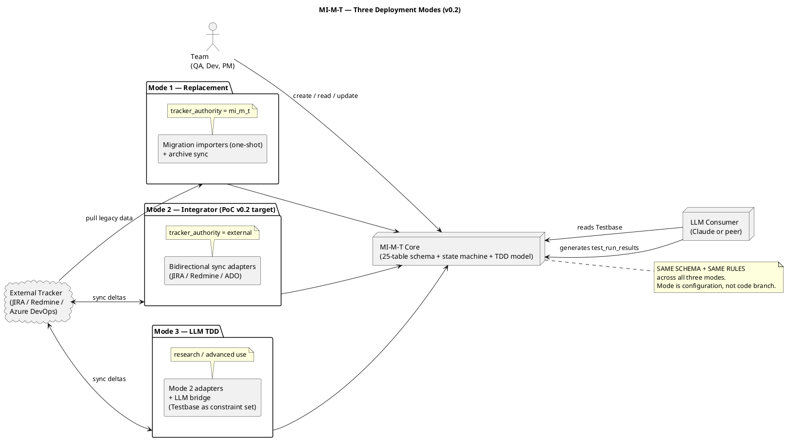
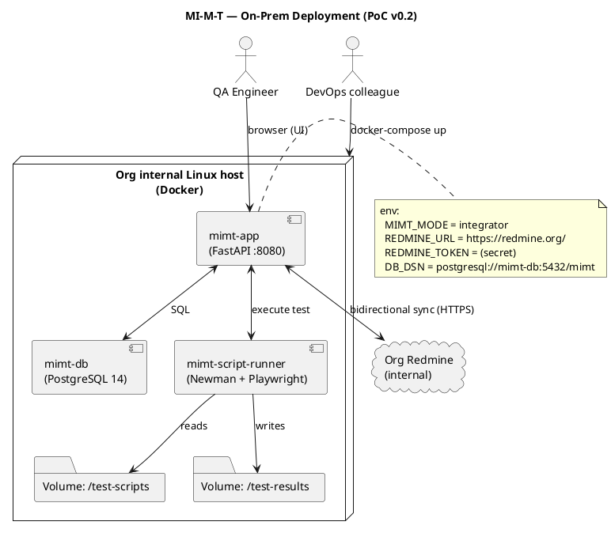

# OPUS-CYCLE v0.2 — MASTER PLAN
## Major Iteration Cycle: MI-M-T Reframing, On-Prem PoC, Three Pilot Tracks in Parallel

**Version:** v0.2.0 — supersedes the post-D-09 strategic plan in OPUS-SESSION-PREP v1.1.0
**Prepared:** 2026-05-03 — MacBook CoWork session (Opus)
**Authority:** This document is the new strategic root for MI-M-T iteration cycle 2. Earlier strategic documents (OPUS-SESSION-PREP v1.1.0) remain valid for **historical context** but are superseded by this plan for **forward planning**.

> **AMENDMENT 2026-05-03 (post-clarification):** Linux/Docker is NOT a hard dependency. A 3-stage maturity model (Stage 0 ThinkPad / Stage 1 Windows-no-admin / Stage 2 on-prem corporate) replaces the original on-prem-Docker primary path. Parallel-implementation discipline (Topology A reference + Topology B Windows-portable) is binding for Stage 0. All 3 deployment modes (Replacement / Integrator / LLM-TDD) are now scaffolded in Stage 0; 3-tier permission hooks (Administrator / PowerUser / TA-Tester) added to schema. Physics calibration deliverable (KH + GR + 2D Ising) added as additional planning track.
>
> **Read in this order for forward planning:**
> 1. This master (§§1–4 only — strategic framing)
> 2. `_config/OPUS-CYCLE-v0.2.1-STAGES-ADDENDUM.md` — supersedes §5.4 + §6 + §7.1 of this master
> 3. `3-fold-path/backlog/PHYSICS-CALIBRATION-MODELS-v0.1.md` — additional physics planning track
> 4. `3-fold-path/backlog/MI-M-T-V0.2-POC-ONPREM-SCOPE.md` — still useful for §2–§9 (Redmine adapter, Playwright/SOAP/REST runners, UI design, hooks, reporting); §1 (Dockerization) superseded by v0.2.1 addendum §2
> 5. `_config/HANDOVER-V0.2-THINKPAD.md` and `_config/HANDOVER-V0.2-MACBOOK.md` — paste-ready Sonnet prompts (now reference v0.2.1)
**Companion deliverables:**
- `3-fold-path/backlog/MI-M-T-V0.2-POC-ONPREM-SCOPE.md` — on-prem PoC scope (9 constraints)
- `_config/GITHUB-ORCH-V0.2.md` — repository topology + parallel-sync protocol
- `3-fold-path/backlog/MIM2000-ALPHA-V0.2.md` — mim2000.cz Projects & Services Alpha page redesign
- `3-fold-path/backlog/KH-SIM-PUBLIC-V0.1.md` — kh-sim public release plan
- `_config/HANDOVER-V0.2-MACBOOK.md` + `_config/HANDOVER-V0.2-THINKPAD.md`

---

## §0. Why this cycle exists

Three independent feedback inputs drove the v0.2 reframing:

1. **Acronym semantics correction.** MI-M-T is **NOT** "Methodology for Integrated Manual Testing". The correct expansion is **"Meta Informed/Inferred/Integrated Measurement (which do) Testing"** — the system is a meta-informed measurement layer whose primary use is testing at every level (manual, scripted, recorded, LLM-driven). The word *manual* never belonged in the name.
2. **Three deployment modes** — replacement / integrator / LLM-TDD — must be explicit in architecture and roadmap. The earlier D-01..D-09 work implicitly built Mode 2 (integrator) primitives but the design didn't say so.
3. **Pilot diversification.** Strategic value compounds when three pilot missions run in parallel: on-prem PoC (organizational traction), mim2000.cz Alpha redesign (external visibility), and kh-sim public release (personal portfolio + LinkedIn proof).

This master plan reconciles those three with the established AS-IS state.

---

## §1. MI-M-T — Reframed Identity

### 1.1 The acronym, unpacked

```
M  Meta            cross-system, cross-artifact awareness
I  Informed /      from sources (data, contracts, prior runs)
   Inferred /      by reasoning (rules, validators, LLM)
   Integrated      into a single deterministic model
M  Measurement     reproducible, evidence-bearing observation
T  Testing         the activity Measurement enables
                   (never the reverse — testing depends on measurement)
```

"Manual" is not in the acronym and never was. MI-M-T stores, plans, schedules, and reports tests at every level.

### 1.2 The three deployment modes (binding architecture)

| Mode | Label | Data ownership | Primary user |
|:----:|-------|----------------|--------------|
| **1** | **Replacement** for JIRA / Redmine / Azure DevOps | MI-M-T owns issues + tests + evidence. Migration connectors *one-shot* import legacy. Legacy → archive. | Greenfield teams, trackerless teams, teams ready to migrate. |
| **2** | **Integrator / orchestrator overlay** | Existing tracker keeps issues. MI-M-T adds testing + orchestration + reporting. Bidirectional sync — cheap (CLI / webhook). | Teams with established tracker investment; near-term PoC adoption path. **This is the v0.2 PoC target.** |
| **3** | **Deterministic Testbase for LLM TDD** | MI-M-T stores requirements + test targets + test cases + data + environment seeds as a deterministic constraint set. Claude (or peer LLM) consumes the Testbase as TDD spec; generates code; MI-M-T runs the tests; results feed back. | AI-augmented dev teams; reference implementation pattern for LLM-coding governance. **Strategic differentiator.** |

**Rule of mode coherence:** all three modes share the same data model (the 25-table schema from D-01..D-09). Mode is a *runtime configuration* + *adapter set*, not a different system. Mode 1 = Mode 2 with `tracker_authority = mi_m_t`. Mode 3 = Mode 2 with the addition of an LLM consumer of the Testbase.

### 1.3 Public messaging discipline

Per user direction: *"do not push the Mode 3 idea directly; demonstrate it in PoCs. Explain it in abstract level in articles."* Public-facing copy should:

- Lead with **what MI-M-T does** (test evidence, traceability, sync) — not what it *means*.
- Mention the acronym expansion as a footer or About-page detail; not the headline.
- Use concrete proof-of-concept demos (the three pilot tracks) as the primary persuasion vehicle.
- Treat Mode 3 (LLM-TDD) as an "advanced use case" or "research mode" in articles, never as the lede.

The renaming addendum (§8 below) carries the canonical positioning text for re-use across pages.

---

## §2. Conceptual Triple: 6-element-chain ⇔ 4-step-noble-steps ⇔ 3-fold-path

The user-stated conceptual model has three interconnected layers that must be made explicit.

### 2.1 The three layers

| Layer | Domain | Elements |
|-------|--------|----------|
| **3-fold-path** | Personal life-and-work integration (the WordPress sites topology) | Mind (zemla.org) · Spirit (mim2000.cz bridges) · Body (bodyterapie.com) |
| **4-step-noble-steps to MI-M-T** | The MI-M-T value chain | Impulse → Test Set → Execution → Evidence |
| **6-element-chain** | The full traceability chain inside MI-M-T (extension of the 4-step) | Stakeholder → Requirement → Test Target → Test Case → Test Run → Evidence Result |

### 2.2 How they interconnect

```
           3-fold-path (life-work integration)
                ▲
                │ MI-M-T is one of the practical demonstrations
                │ inside mim2000.cz (the bridging site)
                │
   4-step-noble-steps to MI-M-T (the public-facing value chain)
                ▲
                │ MI-M-T's 4 steps are the marketing-grade narrative
                │ for what the system does at a glance
                │
   6-element-chain (the full internal data model)
                │
                │ Data contract enforced in the schema:
                │   Stakeholder → Requirement (requirements.yaml)
                │              → Test Target (test-targets.yaml)
                │              → Test Case   (testcases.yaml v2)
                │              → Test Run    (testruns/)
                │              → Evidence    (item_attachments + jira_sync_links)
                ▼
           Implementation (D-01..D-09 schema, 25 tables, 40 Python routes)
```

### 2.3 Element-to-table mapping (6-element-chain → DDL)

| Element | Schema home | Status |
|---------|-------------|--------|
| Stakeholder | `users` (with `role_in_process`) | Implemented |
| Requirement | `requirements.yaml` (off-DB for now); future table `requirements` | YAML only — **gap** for Mode 1/2 production |
| Test Target | `test-targets.yaml` (off-DB); table `test_targets` | YAML + DB both exist; needs sync |
| Test Case | `testcases.yaml` v1 (off-DB) + `test_cases` table | DB live; YAML migration to v2 pending |
| Test Run | `test_runs` + `test_run_results` | Implemented |
| Evidence | `item_attachments` + `jira_sync_links` | Implemented |

**Gap to close (§4 below):** the Requirement and Test Target layers exist as YAML evidence files but have no DB tables yet. v0.2 architecture revision adds them in a later iteration; for the v0.2 PoC, YAML-as-source-of-truth is acceptable with an explicit roadmap to DB.

### 2.4 Why the conceptual triple matters for delivery

- **For PMs / external readers:** the 4-step framework is the elevator pitch.
- **For developers / Sonnet sessions:** the 6-element-chain is the binding data contract.
- **For positioning across the 3-fold-path:** mim2000.cz is the practical demonstration of the meta-informed-measurement *idea* in the professional/teaching domain; zemla.org and bodyterapie.com use the *same disciplines* (consistency, evidence, reproducibility) but in personal/somatic domains.

---

## §3. Consistency Audit — AS-IS vs Target

> What's true today (per the reading list) cross-checked against what v0.2 declares as target.

### 3.1 Build state (verified from reading list)

| Component | AS-IS state (reading list) | v0.2 status |
|-----------|----------------------------|-------------|
| 25-table DDL schema | DONE — 29 migrations, 3 engines green (SQLite + MySQL 8 + PG 14) | **Carry forward.** Schema is the foundation for all 3 modes. |
| Python FastAPI service | DONE — 40 routes, SMK9 20/20 PASS on 3 engines | **Carry forward.** Becomes Mode 2 reference impl. |
| PHP thin layer | DONE — 17 files, 31 API + 14 HTML routes, with 5-route gap on `/api/v1/projects` | **Re-prioritised.** PHP layer is no longer the on-prem PoC vehicle (was Active24 only). It moves to a **future-Active24 demo track** (deferred behind on-prem PoC). |
| JIRA adapter (D03) | DONE | **Mode 2 ready.** No changes. |
| Postman adapter (D04) | DONE | **Mode 2 ready.** Becomes one of the script-runner adapters. |
| Redmine adapter | NOT STARTED | **NEW for v0.2 PoC** — see §6.4 below. |
| Playwright runner adapter | NOT STARTED | **NEW for v0.2 PoC** — see §6.4 below. |
| SOAP/REST proprietary script runner | NOT STARTED | **NEW for v0.2 PoC** — see §6.4 below. |
| Docker packaging for on-prem | NOT STARTED | **NEW for v0.2 PoC** — primary deliverable for Track 1. |
| Auth/permissions | Hooks only | **Hooks only — confirmed out of scope** for v0.2 PoC; design space preserved. |
| Requirements / Test Target DB tables | YAML only | **Out of scope for v0.2 PoC**, hooks only; full DB tables deferred. |
| Reporting module (basic) | NOT STARTED | **NEW for v0.2 PoC** — basic reporting in scope. |
| TestCase lifecycle UI | partial (JIRA-inspired layout discussed in inception) | **NEW for v0.2 PoC** — expand to full lifecycle CRUD UI. |
| testcases.yaml v1 → v2 migration | PENDING (ThinkPad scope) | Carry forward as ThinkPad first action. |
| Active24 production unknowns (OQ-001/002/006/026) | OPEN | **De-prioritised.** Active24 demo is now a future track, not the v0.2 critical path. |
| zemla v1.7.5 / mim2000 v1.9.1 / bodyterapie v1.7.1 | LIVE | Carry forward; mim2000 v1.10.0 planned in Track 2 (Alpha redesign). |
| 12 open bugs across 3 sites | OPEN | Continue parallel maintenance; **not** part of v0.2 critical path but tracked. |

### 3.2 Consistency findings (issues to fix in v0.2)

| # | Finding | Severity | Resolution |
|---|---------|:--------:|------------|
| C-01 | The `Manual` word in the previous full name contradicts the actual capability — system is *not* manual-test-only. | High | **Renamed** in 4 source files (this session); `MANIFEST.yaml` now carries the canonical `full_name` + `short_form` + `three_deployment_modes` blocks. |
| C-02 | Active24 was treated as the production target; reality is on-prem internal infra (DevOps colleague deployment). | High | **Pivot** — primary PoC track is on-prem Dockerized; Active24 demo is a future-track behind the PoC. |
| C-03 | "JIRA primary integration" was assumed; the actual organizational tracker for the PoC target is Redmine. | High | **Pivot** — Redmine adapter becomes the priority sync target for v0.2; JIRA stays as Mode 2 alt. |
| C-04 | The 6-element-chain conceptual layer was implicit; only 4-step-noble-steps was named. | Medium | **Documented** in §2 above; data-model mapping in §2.3. |
| C-05 | Requirement and Test Target layers exist as YAML only; no DB tables. Long-term Mode 1/2 needs DB-backed versions. | Medium | **Acknowledged** as roadmap item v0.3+; v0.2 acceptable with YAML. |
| C-06 | 5 missing PHP `/api/v1/projects` CRUD routes were the previous critical gap; in v0.2 those become *deferred* (PHP layer is no longer the PoC vehicle). | Low | **Defer** to Active24 demo track. Track in OPEN-QUESTIONS-LOG. |
| C-07 | Branch authority was violated in 2026-05-02 session (KB-034); GitHub branch protection was recommended but not enforced via UI. | High (workflow) | **Re-emphasised** in §7 (parallel sync) + handover prompts. Owner must enable branch protection rules on `macbook` and `thinkpad` before next push cycle. |
| C-08 | `Testbase` (the Mode 3 deterministic constraint set) is conceptually new; no schema or contract for how an LLM consumes it. | Low (research) | Add Testbase contract sketch in §6.5; full design deferred to v0.3 dedicated session. |
| C-09 | mim2000.cz `/projects/mi-m-t/` page is currently a static prototype; needs to evolve to the Alpha redesign. | Medium | Track 2 of v0.2 — see MIM2000-ALPHA-V0.2.md. |
| C-10 | kh-sim's CI is green but no public artifact / README has been published as portfolio piece. | Medium | Track 3 of v0.2 — see KH-SIM-PUBLIC-V0.1.md. |

---

## §4. Gap Analysis — what v0.2 PoC must deliver beyond AS-IS

Bounded gaps to close in iteration cycle v0.2 (PoC track only — see §6 for full PoC scope):

| Gap | Description | Owner | Estimated effort |
|-----|-------------|-------|------------------|
| **G-01** | Dockerization (Dockerfile + docker-compose.yml + healthcheck + .env contract) for the FastAPI + DB pair | ThinkPad | 1 session |
| **G-02** | Redmine adapter (REST API; bug bidirectional sync; reuses BaseAdapter pattern from D03/D04) | ThinkPad | 2 sessions |
| **G-03** | Playwright script storage + execution adapter (registers Playwright test suites as MI-M-T `test_scripts` rows; runs Newman-style; collects results into `test_run_results`) | ThinkPad | 2 sessions |
| **G-04** | SOAP + REST proprietary-script storage + execution adapter (similar pattern to G-03) | ThinkPad | 2 sessions |
| **G-05** | TestCase lifecycle CRUD UI — JIRA-inspired (HTML pages backed by FastAPI; basic forms; no SPA yet) | ThinkPad | 3 sessions |
| **G-06** | Basic test cycle management UI (iteration test sets, scheduling) | ThinkPad | 1 session |
| **G-07** | Issue tracking module connected to test execution (failed result → request creation flow; UI surfacing; Redmine bidirectional sync) | ThinkPad | 1 session |
| **G-08** | Basic reporting module (HTML reports: per-iteration, per-test-target, per-component coverage; PDF export deferred) | ThinkPad | 2 sessions |
| **G-09** | DevOps deployment runbook (step-by-step for the colleague; includes prereqs, secrets handling, healthcheck, rollback) | MacBook | 1 session |
| **G-10** | Permissions/roles **hooks** in code (no functional implementation — just decorator/middleware shape, role check abstraction layer) | ThinkPad | 0.5 session |
| **G-11** | Requirements/Test Target/Analytics **hooks** (placeholder routes returning 501 with pointer to v0.3 plan; preserve URL space) | ThinkPad | 0.5 session |
| **G-12** | testcases.yaml v1 → v2 migration (already pending) | ThinkPad | 0.5 session |
| **G-13** | mim2000.cz Projects & Services Alpha page redesign + link to public repos | MacBook | 2 sessions |
| **G-14** | kh-sim public README + minimal physics PoC docstring + LinkedIn-ready portfolio entry | ThinkPad (kh-sim) + MacBook (docs) | 2 sessions |
| **G-15** | GitHub topology decision applied (existing 3 repos + light split if needed for mim2000) | MacBook | 0.5 session |

**Total estimated v0.2 effort:** ~21 Sonnet sessions across MacBook + ThinkPad. Distributed in §7 below.

---

## §5. Architecture Revisions (binding)

### 5.1 Three-mode unified architecture

Single deployable; mode is configuration:

```
┌──────────────────────────────────────────────────────────────────────────┐
│                    MI-M-T Unified Architecture                           │
│                                                                          │
│   ┌─────────────────────────────────────────────────────────────────┐    │
│   │   Configuration: MIMT_MODE = replacement | integrator | llm_tdd │    │
│   └─────────────────────────────────────────────────────────────────┘    │
│                                ↓                                         │
│   ┌─────────────────────────────────────────────────────────────────┐    │
│   │   Core domain (mode-invariant)                                  │    │
│   │   ───────────────────────────────                               │    │
│   │   • 25-table schema (D-01..D-09)                                │    │
│   │   • State machine (12 states, 8 entity types)                   │    │
│   │   • TDD evidence model: REQ → TT → TC → TR → Evidence           │    │
│   │   • Decomposition rules R-RT, R-TC                              │    │
│   └─────────────────────────────────────────────────────────────────┘    │
│       ↑                ↑                ↑                ↑                │
│   ┌───┴────┐      ┌────┴────┐     ┌─────┴────┐      ┌────┴─────┐         │
│   │  HTTP  │      │ Adapter │     │  Script  │      │  LLM     │         │
│   │  API   │      │  Tier   │     │  Runner  │      │  Bridge  │         │
│   │ (Py /  │      │  (D03   │     │  (Newman,│      │  (Mode 3 │         │
│   │  PHP)  │      │  D04 +  │     │  Playwr, │      │  only)   │         │
│   │        │      │  Redmine│     │  SOAP,   │      │          │         │
│   │        │      │  + ADO) │     │  REST)   │      │          │         │
│   └────────┘      └─────────┘     └──────────┘      └──────────┘         │
│                                                                          │
└──────────────────────────────────────────────────────────────────────────┘
```

**Mode-specific adapter sets:**

| Mode | Adapters loaded | Tracker authority | Notable behaviour |
|:----:|-----------------|-------------------|--------------------|
| 1 (Replacement) | All migration importers active; sync adapters in *push-archive-only* | MI-M-T | Legacy tracker is read-only; one-shot import on day 0. |
| 2 (Integrator) | All sync adapters bidirectional; no migration importers active | External tracker | Bidirectional sync; cheap delta (webhook or CLI). PoC v0.2 target. |
| 3 (LLM TDD) | Mode 2 + LLM-bridge adapter exposing Testbase as a structured prompt context | External tracker | Testbase is read-only API surface for LLM; results from LLM-generated code feed back via standard test_run_results path. |

### 5.2 Adapter taxonomy (extends D03/D04)

```
BaseIntegrationAdapter (ABC)                    ← from D-02
├─ TrackerAdapter (ABC)                         ← NEW v0.2
│  ├─ JiraAdapter         (D03)                 ← exists
│  ├─ RedmineAdapter      (NEW G-02)
│  ├─ AzureDevOpsAdapter  (deferred)
│  └─ ZephyrAdapter       (D03)                 ← exists
│
├─ ScriptRunnerAdapter (ABC)                    ← NEW v0.2
│  ├─ NewmanAdapter       (D04)                 ← exists
│  ├─ PlaywrightAdapter   (NEW G-03)
│  ├─ SoapTestAdapter     (NEW G-04)
│  └─ RestTestAdapter     (NEW G-04)
│
└─ LlmBridgeAdapter (ABC)                       ← NEW v0.2 (Mode 3 only)
   └─ ClaudeTestbaseAdapter   (research scope; v0.3+)
```

### 5.3 Data flow (DTO/DSO/DDO per DVA-2016 inspiration)

```
External tracker (Redmine/JIRA/ADO)
    ↓ pull (adapter completes DTO)
    │
DTO ──────────────► TrackerAdapter ──────────────► DSO
                    (validation,                   (mi_m_t.requests,
                     transformation)                mi_m_t.test_cases,
                                                   mi_m_t.test_runs)
                                                   ↓
                                                   ↓ (consumed by)
                                                   ↓
DDO ◄────────────── DDO Composer ◄─────────────── DSO
(report, JSON,      (joins, projections,          (always single-
 LLM context)        format conversions)           writer per DSO)
    ↓
   UI / Sync push / LLM bridge
```

**Rules (binding for Sonnet impl):**
- Every adapter MUST emit DTOs and call DSO writers; never write DSOs directly from outside.
- Every report endpoint MUST return DDOs; never expose raw DSOs.
- LLM bridge MUST consume DDOs only; LLM never sees DSO row IDs / internal columns.

### 5.4 On-prem deployment topology (PoC track)

```
DevOps colleague's internal infra
└─ Docker host (Linux, RHEL/Debian)
   ├─ Container: mimt-app
   │  ├─ FastAPI (port 8080)
   │  ├─ Healthcheck: GET /health
   │  └─ env: MIMT_MODE=integrator, REDMINE_URL, REDMINE_TOKEN, ...
   │
   ├─ Container: mimt-db
   │  ├─ PostgreSQL 14 (preferred) or MySQL 8 (alt)
   │  ├─ Volume: /var/lib/mimt-db
   │  └─ env: POSTGRES_PASSWORD, ...
   │
   ├─ Container: mimt-script-runner
   │  ├─ Newman (Postman CLI), Playwright runtime
   │  └─ Mounts: /test-scripts (read-only), /test-results (read-write)
   │
   └─ (optional) Container: mimt-redmine-stub
      └─ Used in dev only; production points to org Redmine instance
```

### 5.5 Hooks for deferred capabilities (binding)

| Capability | Hook shape (v0.2) | Activation trigger (v0.3+) |
|------------|-------------------|----------------------------|
| User permissions / roles | Decorator `@require_role("...")` returning pass-through; middleware shell with role-resolution stub returning role from `users.role_in_process` | When SSO / RBAC is needed |
| Requirements DB layer | Routes `/api/v1/requirements` returning 501 + pointer to YAML; YAML reader present | When YAML hits scale ceiling |
| Test Target DB layer | Routes `/api/v1/test-targets` already present (in DB); DB-backed Requirement linkage hook | When G-11 deferred work activated |
| Advanced reporting / analytics | Routes `/api/v1/reports/advanced/*` returning 501 + module placeholder | After basic reporting (G-08) ships |
| LLM bridge | Module `mi_m_t.llm_bridge` with abstract `prepare_testbase_context()` returning empty context | Mode 3 dedicated session |

---

## §6. PoC Iteration Scope (v0.2) — Track 1 detailed

**Mode targeted:** Mode 2 (integrator). **Tracker:** Redmine. **Test runners:** Playwright (F/E) + proprietary SOAP/REST.

The 9 user-stated constraints map to deliverables:

| # | User constraint | v0.2 deliverable | Section in this doc |
|:-:|-----------------|------------------|---------------------|
| 1 | ThinkPad-local first; Dockerized for easy on-prem deploy with detailed DevOps doc | G-01 + G-09 | §6.1 |
| 2 | Redmine adapter for bug sync | G-02 | §6.2 |
| 3 | Playwright + SOAP/REST script storage + connector | G-03 + G-04 | §6.3, §6.4 |
| 4 | TestCase creation, storage, lifecycle; basic test-cycle mgmt; issue-tracking module | G-05 + G-06 + G-07 | §6.5, §6.6, §6.7 |
| 5 | F/E motivated by CAST catalogue; JIRA-inspired with Redmine reference | G-05 (UI design pillar) | §6.5 |
| 6 | Permissions/roles NOT in scope, hooks prepared | G-10 | §5.5 |
| 7 | Requirements/Analytics/TestTargets NOT in scope, hooks prepared | G-11 | §5.5 |
| 8 | Basic reporting in scope | G-08 | §6.8 |
| 9 | Impact on GitHub repo + 3-fold-path deliverables in scope | Track 2 + Track 3 | §7 |

> **Full PoC scope detail in:** `3-fold-path/backlog/MI-M-T-V0.2-POC-ONPREM-SCOPE.md`

### 6.1 Dockerization (G-01) + DevOps runbook (G-09)

- `Dockerfile` (multi-stage; Python 3.11 base; pip install with requirements.lock pin).
- `docker-compose.yml` for the 3-container topology (§5.4).
- `.env.example` with all 11 mandatory env vars + comments.
- `healthcheck.sh` script invoked from compose (HTTP 200 on `/health`).
- `Makefile`: `make build / up / down / migrate / seed / test / logs`.
- `RUNBOOK-DEVOPS.md` — step-by-step for the colleague:
  1. Prerequisites (Docker, docker-compose, network ports, persistent storage path)
  2. Initial deploy (`make up`, `make migrate`, `make seed`)
  3. Smoke test (curl /health; create test project; create test target; run a script)
  4. Updating to new version (rebuild, migrate up, restart)
  5. Backup + restore (DB dump cron, volume snapshot)
  6. Rollback (rollback migration `make migrate-down N=1`; container restart)
  7. Troubleshooting (top 10 known errors + fixes; LL-ENV-005..009 references)

### 6.2 Redmine adapter (G-02)

- New module `mi_m_t/adapters/redmine.py`, subclass of `TrackerAdapter`.
- Auth: API token in env var.
- Pull: `pull_issue(redmine_issue_id) → DTO`.
- Push: `push_request(mi_m_t_request) → external_key`.
- Bidirectional sync respects `entity_authority` config (per `mi_m_t` MANIFEST coexistence model).
- Persistence: every sync writes to `jira_sync_links` (rename consideration: rename table to `external_sync_links` in v0.3 — for v0.2 reuse the column with `external_system='redmine'`).
- Smoke replay tests (mirror D03 pattern): record + replay 8-15 fixture HTTP responses.
- Contract doc: `3-fold-path/backlog/MI-M-T-D05-REDMINE-CONTRACT.md` (NEW; ThinkPad authors).

### 6.3 Playwright script runner adapter (G-03)

- New module `mi_m_t/adapters/playwright.py`, subclass of `ScriptRunnerAdapter`.
- Storage: Playwright `.spec.ts` / `.spec.js` files registered as `test_scripts` rows; the file content stored on filesystem (volume `/test-scripts`); the `test_scripts.script_path` column points to the file.
- Execution: spawns Playwright runner in subprocess; captures stdout/stderr + result JSON.
- Result mapping: each `it(...)` block becomes a `test_run_results` row with verdict (`pass` / `fail`); evidence path points to Playwright trace + screenshot.
- API surface:
  - `POST /api/v1/test-scripts/{id}/execute` → starts run; returns `test_run_id`.
  - `GET /api/v1/test-runs/{id}` → results visible as they complete.
- DTO/DSO/DDO discipline (§5.3): runner emits DTOs to the DSO writer.

### 6.4 SOAP + REST proprietary script runner (G-04)

- Two related modules:
  - `mi_m_t/adapters/soap_runner.py` (subclass of `ScriptRunnerAdapter`)
  - `mi_m_t/adapters/rest_runner.py` (subclass of `ScriptRunnerAdapter`)
- Storage: existing proprietary scripts (organisation-defined format; ThinkPad to inspect format and adapt). Stored on filesystem under `/test-scripts/soap/` and `/test-scripts/rest/` respectively.
- Execution: invokes script with parameters from `test_data` JSON; collects pass/fail signal from script exit code or output file.
- Result mapping: similar to G-03.
- Open question: does the org have a standard wrapper for the proprietary scripts (e.g. a CLI), or do they run via direct interpreter invocation? **Resolve in OQ-101 of the v0.2 PoC.**

### 6.5 TestCase lifecycle UI + JIRA-inspired design (G-05)

- HTML pages backed by FastAPI (Jinja2 templates initially; SPA upgrade deferred).
- Page structure mirrors JIRA's issue layout:
  - Left sidebar: project + filters (status, severity, assignee).
  - Centre column: list of test cases with virtual scroll.
  - Right pane: detail view (collapsible sections — Description, Steps, Phases, Resources, Linked requests, History).
  - Top bar: search + create button.
- CAST catalogue motivation: every test case carries the 12-state status, severity (A/B/C/X), priority (H/M/L/X), attention (P/S/I/X) — all visible in the list.
- Lifecycle CRUD endpoints already in DB (D-01..D-09); UI is the new layer.
- Reference design assets:
  - JIRA Cloud screenshots (already familiar to user — no need to reproduce here).
  - Redmine UI for cross-comparison (the org's current tracker).
- Design tokens: colours from CAST severity/priority palette (use TAGS doc tagging for the data flow consistency).

### 6.6 Basic test-cycle management (G-06)

- Iteration Test Set CRUD UI (already DB-backed via `iteration_test_sets`).
- "Add cases to iteration" picker (multi-select from filtered test case list).
- Iteration overview page with progress indicator (% pass / % fail / % pending).

### 6.7 Issue tracking module (G-07)

- "Failed result → create request" CTA in test run results UI.
- Request CRUD UI (mirrors test case page structure).
- Status transitions exposed (existing endpoint `/requests/{id}/transition`).
- Redmine sync trigger: button "Push to Redmine" (calls G-02 adapter).
- Bidirectional pull: scheduled job (cron in container) pulls Redmine status delta and updates `requests.item_status`.

### 6.8 Basic reporting (G-08)

- Three report types (HTML rendered server-side):
  - **Iteration coverage report**: per `iteration_test_sets` row, list cases × verdict matrix.
  - **Test target coverage report**: per `test_targets` row, list cases + most-recent verdict.
  - **Component health report**: per component (filter), bug count by severity + open vs closed.
- Each report has a `Download as JSON` button (DDO export).
- PDF export: deferred (use browser print-to-PDF as fallback in v0.2).

---

## §7. Three Pilot Tracks in Parallel — Iteration Plan

Per user direction (three pilots in parallel) the v0.2 cycle runs across three tracks, each with its own Sonnet session sequence. Tracks are coordinated via GitHub PRs + the sync protocol (`_config/GITHUB-ORCH-V0.2.md`).

### 7.1 Track 1 — On-prem PoC (ThinkPad primary)

| Iter | Owner | Deliverables | Gate |
|------|-------|--------------|------|
| **PoC-01** | ThinkPad | testcases.yaml v1→v2 migration (G-12); Dockerfile + docker-compose first cut (G-01a) | Migration `triage.py --orphan-cases` returns 0; container starts, /health responds |
| **PoC-02** | ThinkPad | Dockerfile finalised + RUNBOOK-DEVOPS.md (G-01b + G-09) | DevOps colleague can deploy from runbook on a clean Linux box (dry-run by ThinkPad) |
| **PoC-03** | ThinkPad | RedmineAdapter contract doc + scaffold (G-02a) | D05-REDMINE-CONTRACT.md authored; replay smoke tests scaffold |
| **PoC-04** | ThinkPad | RedmineAdapter implementation + bidirectional sync (G-02b) | 8-15 replay fixtures green; bug-push smoke against staging Redmine |
| **PoC-05** | ThinkPad | PlaywrightAdapter (G-03) | Register a Playwright spec; execute; results land in `test_run_results` |
| **PoC-06** | ThinkPad | SOAP + REST runner adapters (G-04) | Same shape as G-03; OQ-101 resolved |
| **PoC-07** | ThinkPad | TestCase lifecycle UI part 1 — list + detail (G-05a) | Browse and view test cases via browser |
| **PoC-08** | ThinkPad | TestCase lifecycle UI part 2 — CRUD + state transitions (G-05b) | Create + edit + transition test case via UI |
| **PoC-09** | ThinkPad | Test cycle management UI (G-06) | Browse iterations, add cases, see progress |
| **PoC-10** | ThinkPad | Issue tracking UI + Redmine push button (G-07) | Failed result → request → Redmine round trip |
| **PoC-11** | ThinkPad | Basic reporting (G-08) | Three report types render |
| **PoC-12** | ThinkPad | Hooks for permissions + analytics (G-10 + G-11) + integration smoke | All hooks present; smoke green; PoC demo-ready |

**Track 1 acceptance gate:** DevOps colleague can deploy MI-M-T to a clean Linux host using only `RUNBOOK-DEVOPS.md`; sync round-trip with org Redmine works; one Playwright + one SOAP/REST script runs and produces a result; reporting shows the result.

### 7.2 Track 2 — mim2000.cz Alpha redesign (MacBook primary)

| Iter | Owner | Deliverables | Gate |
|------|-------|--------------|------|
| **MIM-01** | MacBook | Projects & Services Alpha page redesign — content + structure spec (`MIM2000-ALPHA-V0.2.md`) | Spec accepted by user |
| **MIM-02** | MacBook | mim2000-theme v1.10.0 — page-projects-services.php + CSS + nav addition | Local render in Laragon shows the new page |
| **MIM-03** | MacBook | Public repo links wired (kh-sim, mim2000-demo if separate); WordPress publication via Tier 1 deploy | Page live at `mim2000.cz/projects/` (or chosen slug) |

**Track 2 acceptance gate:** new Projects & Services Alpha page is live on mim2000.cz, links to public repos resolve, navigation updated.

### 7.3 Track 3 — kh-sim public release (ThinkPad primary; MacBook docs)

| Iter | Owner | Deliverables | Gate |
|------|-------|--------------|------|
| **KH-01** | ThinkPad | kh-sim repo public-readiness audit: README, LICENSE, CONTRIBUTING, code-of-conduct, basic CI badge | Repo passes a "first-pass open-source-ready" checklist |
| **KH-02** | MacBook | LinkedIn-ready portfolio entry (one paragraph + link); zemla.org Physics page link to kh-sim added | LinkedIn post drafted; zemla.org change spec drafted |

**Track 3 acceptance gate:** kh-sim repo public, README explains physics simulation purpose + how to run; portfolio entry visible on LinkedIn + linked from zemla.org.

### 7.4 Total iteration count and parallelism

- **Total iterations:** 12 (Track 1) + 3 (Track 2) + 2 (Track 3) = **17**.
- **Parallel slots:** ThinkPad and MacBook are independent. Up to 1 iteration per device per day (rough cadence). Practical cycle: ~3-4 weeks for the full v0.2 if both devices run regularly.
- **Sync points:**
  - End of each iteration: commit + push to own branch.
  - Every 3 iterations OR major track milestone: PR to `main` for integration.
  - End of v0.2 cycle: full Opus retrospective + v0.3 planning session.

---

## §8. Renaming Catalog

This session edited 4 files to apply the new MI-M-T expansion:

| File | What changed |
|------|--------------|
| `MANIFEST.yaml` (line 126) | `full_name` corrected; added `short_form` block + `three_deployment_modes` block + revised `positioning` text |
| `_config/OPUS-SESSION-PREP-MI-M-T-PROD.md` (line 101-102) | Added rename note; superseded label; pointer to this master doc |
| `3-fold-path/code/mi_m_t/pyproject.toml` (line 8) | Package `description` corrected |
| `3-fold-path/code/mi_m_t/mi_m_t/main.py` (FastAPI factory) | API description string corrected; added the three-modes summary line |

**Forward-discipline rules** (apply to every new doc/code from now):

- Header line for any new MI-M-T doc: `**Project:** MI-M-T (Meta Informed/Inferred/Integrated Measurement (which do) Testing)` — or just `MI-M-T` if the rest of the doc explains the expansion.
- Public-facing copy (mim2000.cz, README, LinkedIn): use the **4-step framework** as the primary hook; the acronym expansion goes in About / footer.
- Code comments: `MI-M-T` short form is fine; expansion not needed except at module entry points.

---

## §9. Risk Register

| ID | Risk | Likelihood | Impact | Mitigation |
|----|------|:----------:|:------:|------------|
| R-01 | DevOps colleague rejects the runbook (too hard, missing detail) | M | H | Dry-run G-09 on a fresh Linux VM (ThinkPad) before handing off; iterate runbook from the colleague's first feedback. |
| R-02 | Redmine API differs in this org instance from doc; adapter breaks | M | M | RedmineAdapter contract doc (G-02a) authored against actual org instance, not generic docs; smoke tests use real org responses recorded with curl. |
| R-03 | Proprietary SOAP/REST scripts have no standard CLI; runner needs custom shim | H | M | OQ-101 in PoC-06; if shim is large, scope to one example per type and defer the rest. |
| R-04 | Branch authority violated again (KB-034 pattern) — devices push each other's branches | M | H | Owner enables GitHub branch protection on `macbook` + `thinkpad` before next push (one-time UI action). Handover prompts re-emphasise. |
| R-05 | Two devices independently fix same bug (KB-035 pattern) | M | M | PR-on-main pattern (§7.4) surfaces the duplicate via merge conflict; reconcile in retrospective. Each device's open-questions log is read by the *other* device at session start. |
| R-06 | mim2000.cz Alpha page redesign blocks on user content (copy, screenshots) | M | M | Track 2 spec doc (MIM2000-ALPHA-V0.2) lists user-supplied content explicitly; placeholders allowed in MIM-02. |
| R-07 | kh-sim physics PoC discovered to be incomplete on closer inspection | L | M | Track 3 KH-01 audit catches scope before public release. Worst case: ship as "experimental" tag. |
| R-08 | Naming reframe causes external confusion (people still expect "Manual Testing") | L | L | Public copy never uses old name; old name only appears in historical context with explicit note. |
| R-09 | Mode 3 (LLM TDD) invoked publicly too early; prospects expect more than v0.2 delivers | M | H | Per user direction: do NOT mention Mode 3 in public copy; keep as "advanced research mode" footnote. |
| R-10 | testcases.yaml v2 migration (G-12) breaks SMK9 | L | M | Run SMK9 immediately after migration; rollback via reverse migration if red. |

---

## §10. Diagrams

### 10.1 Three-mode runtime topology



### 10.2 PoC on-prem deployment (DevOps colleague target)



### 10.3 Parallel-track sync flow (3 pilots, 2 devices, GitHub mediation)

```plantuml
@startuml MI-M-T-Parallel-Tracks-v0.2
title MI-M-T — Three Pilot Tracks in Parallel (v0.2)
skinparam shadowing false

actor "Petr\n(human owner)" as owner

box "MacBook" #LightBlue
participant "Sonnet\n(MacBook)" as macsonnet
end box

box "ThinkPad" #LightYellow
participant "Sonnet\n(ThinkPad)" as tpsonnet
end box

cloud "GitHub\n(petr-yamyang)" as github

box "Track 1 — On-prem PoC" #LightCoral
participant "PoC code\n(mi_m_t/, RUNBOOK)" as poc
end box

box "Track 2 — mim2000.cz Alpha" #LightGreen
participant "mim2000-theme\nv1.10.0" as mim
end box

box "Track 3 — kh-sim public" #LightPink
participant "kh-sim public\n(README, LICENSE)" as khsim
end box

owner -> tpsonnet : open ThinkPad session\n(handover-thinkpad-v0.2)
owner -> macsonnet : open MacBook session\n(handover-macbook-v0.2)

tpsonnet --> poc : implement PoC iter
tpsonnet --> khsim : Track 3 audit
tpsonnet --> github : push thinkpad branch

macsonnet --> mim : Track 2 redesign
macsonnet --> github : push macbook branch

github --> github : PR to main\n(integration gate)
owner --> github : review + merge

note over github
    Branch authority enforced (KB-034):
      macbook → MacBook only
      thinkpad → ThinkPad only
      main → PR merge only
end note

@enduml
```

---

## §11. What this Opus session produced (artifact list)

| File | Purpose | Status |
|------|---------|--------|
| `_config/OPUS-CYCLE-v0.2-MASTER.md` (this) | Master plan, consistency, gap, architecture, risk | DONE |
| `MANIFEST.yaml` (edited) | Renamed full_name + 3-modes block + positioning | DONE |
| `_config/OPUS-SESSION-PREP-MI-M-T-PROD.md` (edited) | Added rename note + supersession pointer | DONE |
| `3-fold-path/code/mi_m_t/pyproject.toml` (edited) | Package description renamed | DONE |
| `3-fold-path/code/mi_m_t/mi_m_t/main.py` (edited) | API description renamed + modes hint | DONE |
| `3-fold-path/backlog/MI-M-T-V0.2-POC-ONPREM-SCOPE.md` | PoC scope detail (9 constraints) | DONE (separate file) |
| `_config/GITHUB-ORCH-V0.2.md` | Repo topology + parallel sync protocol | DONE (separate file) |
| `3-fold-path/backlog/MIM2000-ALPHA-V0.2.md` | Projects & Services Alpha redesign spec | DONE (separate file) |
| `3-fold-path/backlog/KH-SIM-PUBLIC-V0.1.md` | kh-sim public release plan | DONE (separate file) |
| `_config/HANDOVER-V0.2-MACBOOK.md` | MacBook Sonnet handover prompt | DONE (separate file) |
| `_config/HANDOVER-V0.2-THINKPAD.md` | ThinkPad Sonnet handover prompt | DONE (separate file) |

---

## §12. What Opus deliberately did NOT do this session

| Decision | Reason |
|----------|--------|
| Did not edit `CLAUDE.md` | Per branch authority — let MacBook Sonnet integrate v0.2 references in next session |
| Did not edit `requirements.yaml` / `test-targets.yaml` / `testcases.yaml` | Schema migrations (G-12) are ThinkPad scope per branch authority |
| Did not write the Redmine contract spec | ThinkPad PoC-03 authors against real org Redmine instance |
| Did not write the LLM-bridge code | Mode 3 is research scope; v0.3 dedicated session |
| Did not address the 12 open bugs across 3 sites | Out of v0.2 critical path; tracked separately |
| Did not resolve OQ-001/002/006/026 (Active24) | Active24 demo is now a future track behind PoC v0.2 |
| Did not write GitHub Actions for the new adapters | Carry over to PoC iteration sessions; CI-first approach respected |

---

## §13. Status footer

| Item | Value |
|------|-------|
| Document | `OPUS-CYCLE-v0.2-MASTER.md` |
| Output position | `_config/OPUS-CYCLE-v0.2-MASTER.md` |
| Tracks defined | 3 (PoC / mim2000 / kh-sim) |
| Iterations defined | 17 (12 + 3 + 2) |
| Gaps catalogued | 15 (G-01..G-15) |
| Risks catalogued | 10 (R-01..R-10) |
| Renaming applied | 4 files (verified §8) |
| Three-mode architecture | DEFINED (§5.1) |
| Branch authority | RE-EMPHASISED (§9 R-04 + handovers) |
| Companion artifacts | 6 docs (see §11) |
| Status | Draft v0.2 — ready for two parallel Sonnet sessions |

---

*OPUS-CYCLE-v0.2-MASTER.md — 2026-05-03 — MacBook CoWork session — Opus*
