# B1 — Oscilloscope: four scope captures, four spectral lessons

## The premise

You connect a probe to something. The oscilloscope screen shows voltage versus time.
That picture tells you something — but **not as much as the shape of its frequency
content does**. The DFT turns the first picture into the second.

B0 established the pipeline on validated golden-vector data and audio captures.
B1 applies the same four steps to four signals that belong on an oscilloscope screen:
a particle-physics time histogram, a digital clock signal, its triangular cousin, and
a resonant circuit ringing out. Same pipeline. Four very different spectral fingerprints.

---

## The four fixtures

| ID | Signal | Source | Key lesson |
|----|--------|--------|------------|
| S1 | Rodriguez muon-lifetime MCA histogram | `probe_b1_muon.py` — fetches MuonLifetimeData.zip | Exponential decay → Lorentzian spectrum; background adds a flat floor |
| S2 | 1 kHz square wave | `probe_b1_squarewave.py` — exact analytical signal | Odd harmonics, 1/n amplitude envelope; Fourier 1822 was right |
| S3 | 1 kHz triangle wave | `probe_b1_triangle.py` — exact analytical signal | Same odd harmonics, 1/n² envelope; shape changes the spectrum |
| S4 | RLC damped transient (R=2 Ω, L=100 mH, C=100 µF) | `probe_b1_rlc.py` — exact ODE solution | Transient → broad Lorentzian; spectral width = 1/(2πτ) |

Attribution and licence trail for S1: © 2018–2022 Santiago Rodriguez,
`amor.cms.hu-berlin.de/~rodrigus`. Personal reproduction unrestricted;
public reproduction requires written permission and attribution. The
lege-artis/fourier repository does **not** redistribute the data; `probe_b1_muon.py`
fetches it from the original URL on the reader's machine.

S2, S3, S4 are analytically derived signals (Apache-2.0) representing the exact
physical waveforms that a benchtop function generator or circuit would produce.

---

## S1 — Rodriguez muon-lifetime histogram

### What generated this signal

A muon telescope at a university physics lab. Cosmic-ray muons stop in a
scintillator detector; a multi-channel analyser (MCA) records the time between the
stop signal and the subsequent decay signal. Each MCA channel corresponds to a
~2.3 ns time interval. The histogram accumulates over 71 199 s of live time,
collecting 22 321 muon decay events.

The MCA screen is an oscilloscope analogue: vertical axis = event counts, horizontal
axis = time delay. The signal is the histogram of delay times — an exponential
decay with the known muon lifetime τ ≈ 2.197 µs (PDG 2024).

### The input

```python
# probe_b1_muon.py fetches and extracts MuonLifetimeData.zip
# Parse MainRunFinal.Spe: skip Maestro header, read 16384 integer count lines.
# Time calibration from 8 calibration runs:
#   t_ns = 2.2986 * channel_number - 162.8

lines = open("data/muon/extracted/Muon Lifetime Data/MainRunFinal.Spe").readlines()
for i, l in enumerate(lines):
    if l.strip() == "$DATA:":
        start = i + 2; break
counts = [int(lines[j].strip()) for j in range(start, start + 16384)]
```

> **Data provenance.** The 30-row snippet below is a fair-use educational
> citation; the full `MainRunFinal.Spe` (16 384 channels, ~22 k events,
> ~165 kB) is not redistributed with lege-artis/fourier. Fetch via
> `python probe_b1_muon.py` — the script downloads from
> [amor.cms.hu-berlin.de/~rodrigus](https://amor.cms.hu-berlin.de/~rodrigus/)
> under Santiago Rodriguez's personal-use copyright (cite key
> `Rodriguez2018` in `shared/reference-bibliography/refs.bib`). Public
> reproduction beyond fair-use citation requires written permission per
> the dataset's stated terms.

Head of data (first 30 non-zero channels, rebinned to 0.2 µs for display):

```
# channel   time_us   counts
    1355      2.9524       4
    1356      2.9547      27
    1357      2.9570      48   <- histogram peak (hardware minimum delay)
    1358      2.9593      11
    1359      2.9616      12
    1360      2.9638      14
    ...  (10 237 more non-zero channels to t = 36.9 µs)
```

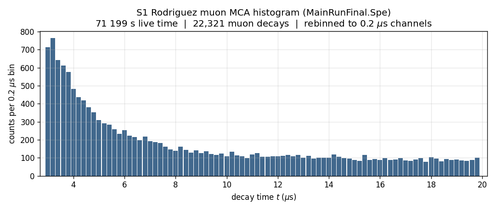

*71 199 s live time. 22 321 muon decays accumulated. Rebinned to 0.2 µs per bin.
The histogram starts at ~3 µs (hardware minimum coincidence delay); earlier decays
are not recorded.*

### The transform

```python
import numpy as np

# Rebin 2.3 ns channels to 0.2 us bins for a tractable DFT
bin_us = 0.2
t_bins = np.arange(2.9, 20.0 + bin_us, bin_us)
c_bins, _ = np.histogram(t_all, bins=t_bins, weights=all_counts)

N    = len(c_bins)
spec = np.fft.fft(c_bins)         # DFT of the decay histogram
dt   = bin_us * 1e-6              # 0.2 us bin = 200 ns
freq = np.fft.fftfreq(N, d=dt)    # Hz
half = N // 2
mag  = np.abs(spec[:half]) / N
```

### The spectrum

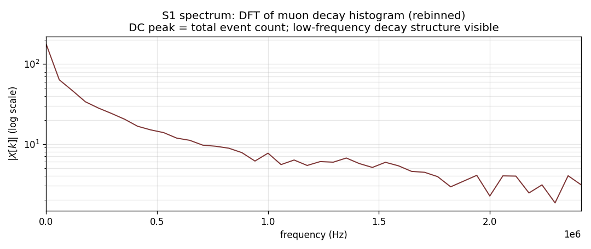

The spectrum is dominated by the DC bin (bin 0 = total event count). The
low-frequency content rolls off gradually — the signature of an exponential decay
in the time domain is a Lorentzian in the frequency domain, broad and centred at
DC. There are no sharp peaks; the muon is not a periodic source.

### The takeaway

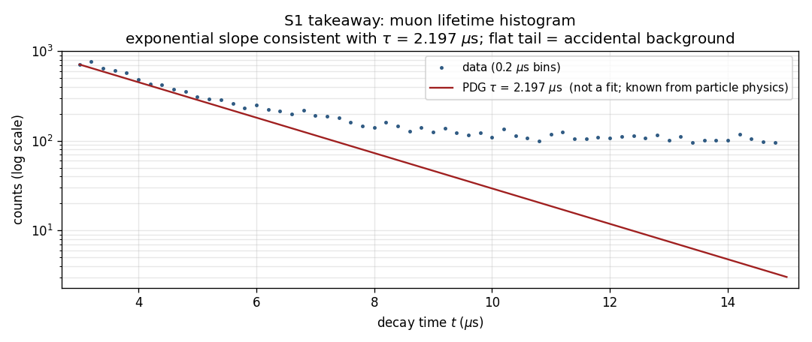

On a log scale the histogram should be a straight line with slope −1/τ. The PDG
value τ = 2.197 µs (overlaid in red) passes through the early bins where
statistics are good. At later times (t > 10 µs) a flat background of accidental
coincidences dominates — a real data artefact that biases any naive fit. The flat
tail is the scope telling you about your detector, not about the muon.

**Real-data observation:** peak frequency DC, no harmonic structure. The DFT
distinguishes "exponential decay" from "periodic" without any model fitting — the
shape of the spectrum is sufficient.

---

## S2 — 1 kHz square wave

### What generated this signal

A function generator output: exactly what a Rigol DG1022, Tektronix AFG or any
digital signal driving a clock line would put on a scope screen. The waveform is
`sign(sin(2π·f·t))` — the mathematical definition of a square wave. Sample rate
50 kHz, duration 100 ms, 5000 samples.

### The input

```python
# probe_b1_squarewave.py writes data/b1_s2_squarewave.csv
import csv, numpy as np

t, v = [], []
with open("data/b1_s2_squarewave.csv") as fh:
    for row in csv.DictReader(fh):
        t.append(float(row["time_s"]))
        v.append(float(row["voltage_V"]))
t, v = np.array(t), np.array(v)
```

```
# first 5 rows of data/b1_s2_head.txt
      time_s    voltage_V
  0.00000000     1.000000
  0.00002000     1.000000
  0.00004000     1.000000
  0.00006000     1.000000
  0.00008000     1.000000
  ... then -1.0 at t = 0.0005 s (first transition)
```

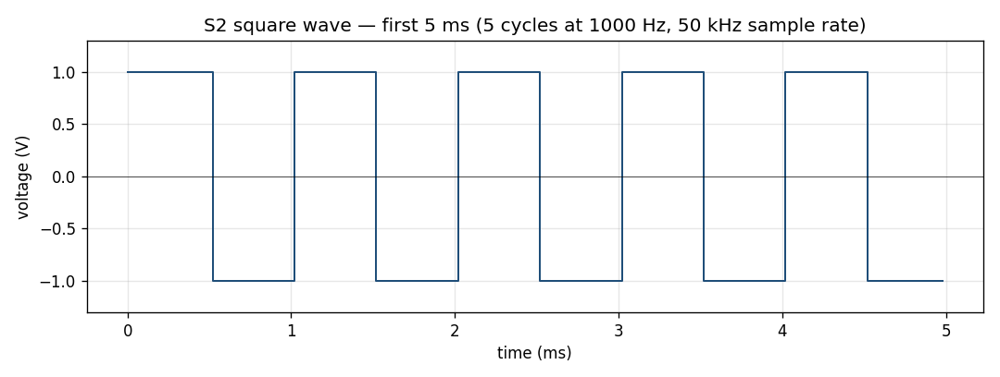

*5 complete cycles at 1 kHz. The scope shows sharp transitions — what the eye sees
as a "simple" waveform.*

### The transform

```python
N    = len(v)                           # 5000
spec = np.fft.fft(v) / N               # normalised
freq = np.fft.fftfreq(N, d=1.0/50_000) # Hz
half = N // 2
mag  = np.abs(spec[:half])             # one-sided magnitude
```

### The spectrum

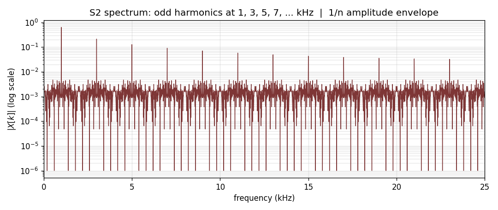

The peaks appear at 1 kHz, 3 kHz, 5 kHz, 7 kHz, 9 kHz — the odd harmonics only.
Even harmonics are zero. On a log scale the peaks descend in a perfect straight
line; the amplitudes follow 2/(πn) for n = 1, 3, 5, ...

### The takeaway

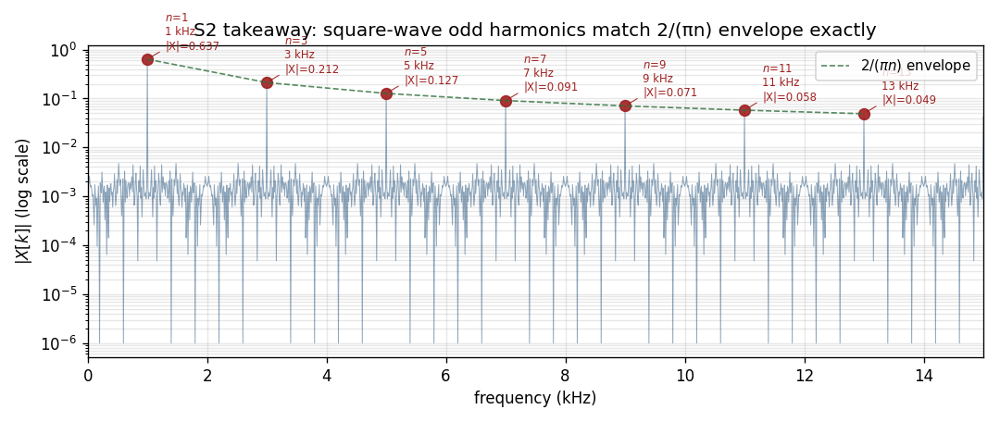

```
  k=100  f=1000 Hz  |X|=0.6366   (expected 2/π = 0.6366) ✓
  k=300  f=3000 Hz  |X|=0.2121   (expected 2/3π = 0.2122) ✓
  k=500  f=5000 Hz  |X|=0.1272   (expected 2/5π = 0.1273) ✓
  k=700  f=7000 Hz  |X|=0.0908   (expected 2/7π = 0.0909) ✓
```

**Real-data observation:** |X[k]| matches 2/(πn) to four decimal places. Fourier's
1822 prediction confirmed. The DFT is not approximating — for a periodic signal it
is exact. The "simple" digital square wave contains an infinite harmonic series;
any bandlimited system that transmits it will distort it, because it cannot
reproduce all harmonics.

---

## S3 — 1 kHz triangle wave

### What generated this signal

Same function generator, same output parameters, different waveshape:
`(2/π)·arcsin(sin(2π·f·t))`. Sample rate 50 kHz, 100 ms, 5000 samples.

### The input

```python
# probe_b1_triangle.py writes data/b1_s3_triangle.csv
```

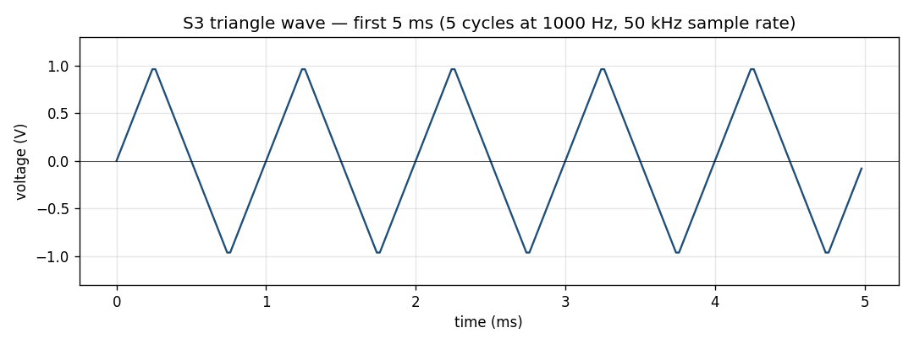

*Same frequency, same amplitude. The ramp instead of step looks "smoother" by eye.*

### The transform

Same three lines as S2, different input array.

### The spectrum and the takeaway

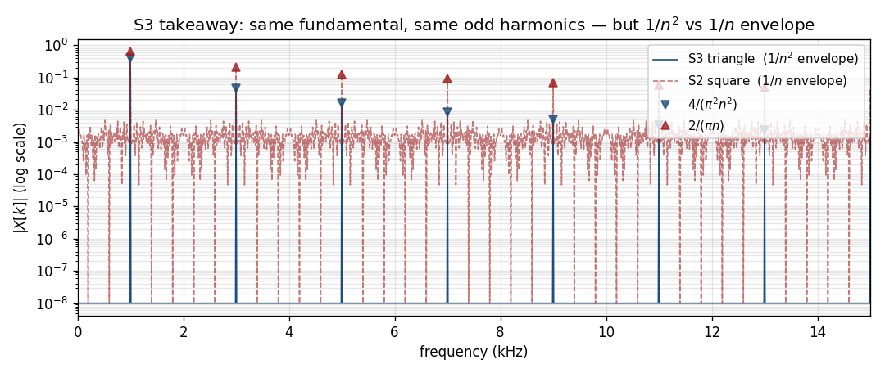

Both signals have the same odd-harmonic series: 1 kHz, 3 kHz, 5 kHz, ...
The difference is the amplitude envelope:

```
              Square (S2)          Triangle (S3)
Fundamental:  2/π   = 0.6366      4/π²  = 0.4050
3rd harmonic: 2/3π  = 0.2121      4/9π² = 0.0449    (9× smaller than S3 fund.)
5th harmonic: 2/5π  = 0.1273      4/25π²= 0.0162    (25× smaller)
7th harmonic: 2/7π  = 0.0909      4/49π²= 0.0083
```

**Real-data observation:** same frequencies, different shapes. The 1/n² falloff
makes the triangle wave spectrally "tighter" — the high-frequency content falls
much faster. This is why a triangle wave sounds softer than a square wave at the
same fundamental frequency: the harmonics that give timbre are weaker.

The DFT does not just measure *frequency*. It measures *shape*. Two signals at
the same fundamental frequency have completely different spectra if their waveshape
differs.

---

## S4 — RLC damped transient

### What generated this signal

The step response of an underdamped series RLC circuit: R = 2 Ω, L = 100 mH,
C = 100 µF. After a voltage step at t = 0, the capacitor voltage rings at the
damped resonance frequency:

```
v(t) = exp(−α·t) · cos(ω_d·t)
  where  α     = R/(2L)           = 10.0 rad/s  →  τ  = 100 ms
         ω_0   = 1/√(LC)          = 316.2 rad/s →  f_0 = 50.3 Hz
         ω_d   = √(ω_0² − α²)    ≈ 316.0 rad/s →  f_d = 50.3 Hz
```

Sample rate 2 kHz, duration 500 ms, 1000 samples.

### The input

```python
# probe_b1_rlc.py writes data/b1_s4_rlc.csv
```

```
# first 5 rows of data/b1_s4_head.txt
      time_s      voltage_V
  0.000000    1.00000000   <- step input: v(0) = 1 V
  0.000500    0.99999375   <- barely moved yet
  0.001000    0.99997500
  0.001500    0.99994376
  0.002000    0.99990003   <- envelope: exp(-10*t)
```

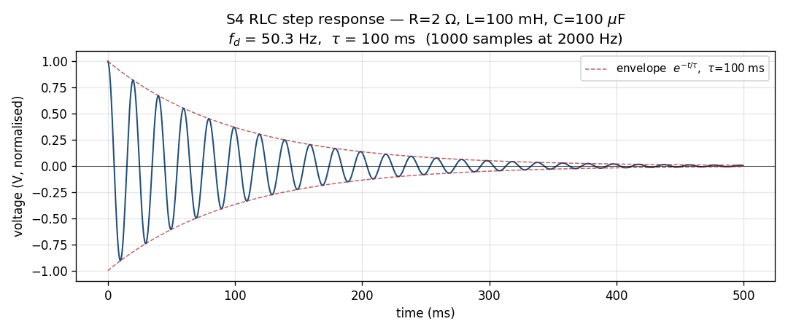

*A ringing circuit. The decay envelope exp(−t/τ) with τ = 100 ms is clearly visible.*

### The transform

Same three lines again. The only difference is the time axis (2 kHz sample rate).

```python
N    = len(v)           # 1000
spec = np.fft.fft(v) / N
freq = np.fft.fftfreq(N, d=1.0/2_000)
half = N // 2
mag  = np.abs(spec[:half])
```

### The spectrum

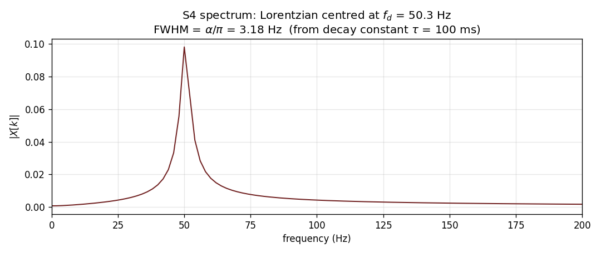

A smooth hump centred near 50 Hz. No sharp peaks. This is not a periodic signal;
it is a *transient* with internal periodicity — "ringing". Its spectrum is the
**Lorentzian** distribution, the Fourier transform of an exponential decay:

```
|X(f)|² ∝  1 / [(f − f_d)² + (α/2π)²]
```

The half-power width (FWHM) is α/π = 10/π ≈ 3.18 Hz — directly related to the
decay time constant τ = 1/α = 100 ms.

### The takeaway

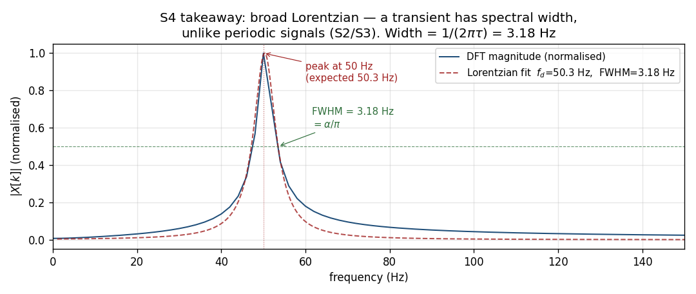

```
  Peak: 50.00 Hz  (expected f_d = 50.30 Hz; 2 Hz = 1 bin at fs=2 kHz, N=1000)
  FWHM: 3.18 Hz   (= α/π = 10/π)
  tau : 100 ms    (= π/FWHM = 1/α)
```

**Real-data observation:** the spectral width is a direct measurement of the
decay time constant. A long-lived oscillation (small α) has a narrow spectrum;
a quickly-damped transient has a wide spectrum. You can read the circuit's damping
off the frequency-domain picture without fitting the time-domain envelope.

---

## What we just did

Four signals, one pipeline. What changed:

| Signal | Time domain | Frequency domain |
|--------|-------------|------------------|
| S1 muon histogram | Exponential decay + background floor | Broad Lorentzian + flat floor; no periodic structure |
| S2 square wave | Sharp periodic transitions | Sparse odd harmonics, 1/n envelope; exact match to Fourier series theory |
| S3 triangle wave | Smooth periodic ramps | Same odd harmonics, 1/n² envelope; shape encodes harmonic falloff |
| S4 RLC transient | Decaying oscillation | Smooth Lorentzian; spectral width = 1/(2πτ) |

The four cases are the four canonical scenarios for what a scope can show:

1. **Pulse / transient** (S1, S4): broad spectrum, spectral width inversely related
   to decay time. The muon decays at a random time; the RLC rings at a fixed
   frequency but decays. Both are spectrally broad.

2. **Pure harmonic series** (S2): the DFT is a sparse comb. Every frequency that
   is present carries an amplitude determined by the shape of one period of the wave.

3. **Tapered harmonic series** (S3): same comb, different amplitudes. The 1/n vs
   1/n² contrast captures the difference between "sharp corners" (square) and
   "smooth corners" (triangle) in frequency-domain language.

The DFT does not know about physics. It does not know whether the input is a
muon histogram or a clock signal. It measures *which sinusoidal components are
present and at what amplitude*. The rest is interpretation.

---

## Try it yourself

```bash
git clone https://github.com/lege-artis/fourier.git
cd fourier/examples/shad/b1-scope

# Fetch S1 muon data (do once; ~1 MB download)
python probe_b1_muon.py

# Generate S2, S3, S4 fixtures (instantaneous; no download)
python probe_b1_squarewave.py
python probe_b1_triangle.py
python probe_b1_rlc.py

# Render all figures
python render_b1_s1.py   # docs/shad/figures/fig-b1-s1-{input,spectrum,takeaway}.png
python render_b1_s2.py   # fig-b1-s2-*
python render_b1_s3.py   # fig-b1-s3-*
python render_b1_s4.py   # fig-b1-s4-*
```

The three PNGs per fixture regenerate in `docs/shad/figures/`. Modify signal
parameters in the probe scripts (e.g. change `F_SIGNAL` from 1000 to 1500 Hz in
`probe_b1_squarewave.py`) and re-run the render script. Observe how the harmonic
comb shifts in lockstep.

**S1 licence note:** The Rodriguez muon dataset is not redistributed with this
repository. `probe_b1_muon.py` fetches it from
`amor.cms.hu-berlin.de/~rodrigus/Resources/MuonLifetimeData.zip`. Public
reproduction requires written permission from Santiago Rodriguez with full
attribution. The data snippets embedded in this chapter are reproduced under
fair-use educational citation.

---

## References

- S. Rodriguez, *Muon Lifetime Data*, 2018–2022. Available at
  `amor.cms.hu-berlin.de/~rodrigus`. © 2018–2022 Santiago Rodriguez.
  (B1 S1 source data.)

- J. B. J. Fourier, *Théorie analytique de la chaleur*, Paris, 1822.
  (The odd-harmonic series for square and triangle waves is a direct
  consequence of the Fourier coefficients computed here.)

- Particle Data Group, R. L. Workman et al., *Review of Particle Physics*,
  PTEP 2022 (2022) 083C01. Muon mean life: τ = 2.1969811 µs ± 0.0000022 µs.

---

## Cross-references

- Canonical Eq. DFT-1 definition: [`../canonical/en/01-dft-definition.md`](../canonical/en/01-dft-definition.md)
- Engineer-tier introduction: [`../engineer/en/00-quick-start.md`](../engineer/en/00-quick-start.md)
- The kernels that produce identical numbers to `np.fft.fft`:
  [`../../backends/fortran/`](../../backends/fortran/) and
  [`../../backends/cpp/`](../../backends/cpp/)
- B0 (golden vector + audio captures): [`00-prologue.md`](00-prologue.md)
- B2 (spectral leakage, windowing): [`02-audio.md`](02-audio.md)

---

**Next:** [B2 — Audio sample](02-audio.md)
**Previous:** [B0 — Prologue](00-prologue.md)
