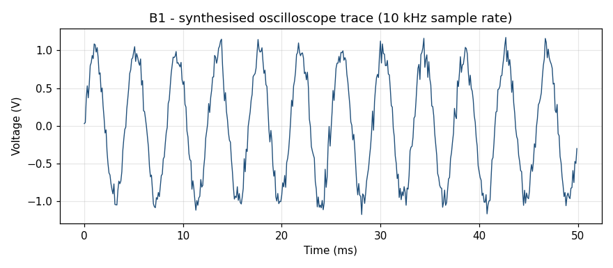
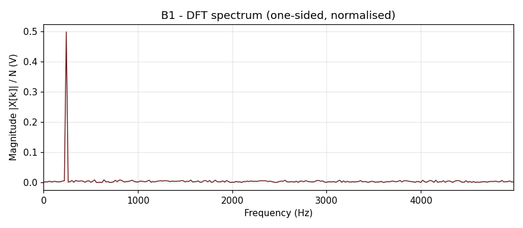
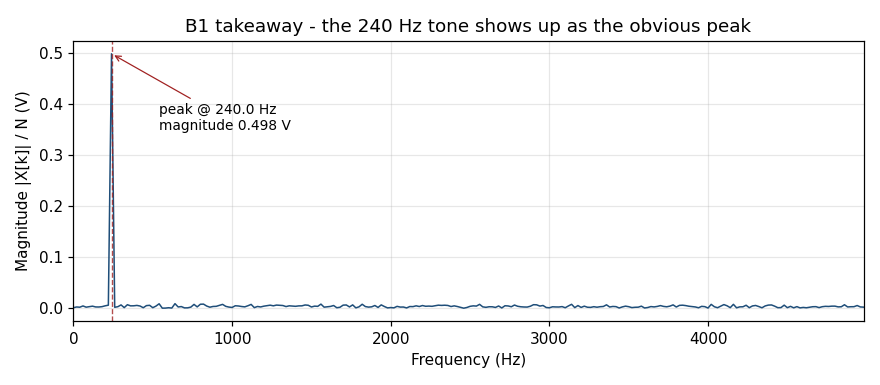

# B1 — Oscilloscope trace

## The premise

You have a signal that varies over time. Voltage from a probe. Pressure from a microphone. The first column of a CSV someone emailed you. The shape of it on a scope screen tells you something — but **not as much as the shape of its frequency content** does.

The Discrete Fourier Transform is the machine that turns the first picture into the second.

## The input

`examples/shad/b1-scope/main.py` synthesises a scope trace: a 240 Hz sine wave at 1 V amplitude, sampled at 10 kHz for 50 ms, with a 10% noise floor. This is what a function generator output would look like if you probed it with a benchtop scope.



Five hundred samples (10 kHz × 50 ms). The sine is visible by eye — twelve full cycles in 50 ms gives 240 Hz, which is what we put in. The noise jitter is what makes this look like a real measurement rather than a textbook diagram.

## The transform

```python
import numpy as np

# samples = the 500 voltage values you just plotted
n = samples.size                       # 500
spec = np.fft.fft(samples) / n         # complex spectrum, normalised
freq = np.fft.fftfreq(n, d=1.0/10_000) # bin frequencies in Hz
half = n // 2
freq, mag = freq[:half], np.abs(spec[:half])
```

That's it. Three lines. `np.fft.fft` returns the same thing the [Fortran reference](../../backends/fortran/src/dft_kernel.f90) and the [C++ reference](../../backends/cpp/src/dft_kernel.cpp) in this repo return: the complex amplitudes of the frequency components that, when summed back, would reproduce the input. The normalisation by `n` and the slice to half are conventions; we're taking the **one-sided magnitude spectrum** because the input is real and we don't want to plot the mirror image at negative frequencies.

## The spectrum



One bin per 20 Hz (10 kHz sample rate ÷ 500 samples = 20 Hz bin width). The peak at 240 Hz is so dominant the rest looks like a flat noise floor. Which is exactly what you'd expect: there's one tone in the input, and everything else is the white noise we added.

## The takeaway



Peak amplitude is 0.498 V, which is half the 1.0 V amplitude we put in. That's not a bug — it's the **two-sided / one-sided convention**. A real cosine of amplitude A has energy at both `+f` and `-f` in the two-sided spectrum, each at A/2. When we throw away the negative-frequency half (which is conjugate-symmetric for a real input — see [B3](03-vibration.md) and [the canonical-tier Hermitian property](../canonical/en/01-dft-definition.md)), the peak we see is A/2. Double it if you want amplitude back.

## What we just did

**One signal → one peak.** Hardest possible case for a tutorial. But the workflow generalises:

1. Get samples + sample rate.
2. Run `np.fft.fft` (or equivalent) and slice to the one-sided half.
3. Plot magnitude against bin-frequency.
4. Read the peaks.

The next two chapters add complications. B2: what if there are *several* peaks? B3: what if the peaks aren't where you expected them, and what they mean for industrial monitoring?

## Try it yourself

```bash
git clone https://github.com/lege-artis/fourier.git
cd fourier
python examples/shad/b1-scope/main.py
```

The three PNGs in `docs/shad/figures/fig-b1-*.png` regenerate. Modify the `signal_hz`, `noise_amp_v`, or `duration_s` arguments in `synth_scope_trace()` at the top of `main.py` and re-run. Note how a non-integer-bin frequency (e.g. 250 Hz instead of 240) makes the peak smear across two bins — that's **spectral leakage**, which B2 makes the central topic.

## Cross-references

- Canonical Eq. DFT-1 definition: [`../canonical/en/01-dft-definition.md`](../canonical/en/01-dft-definition.md)
- Engineer-tier introduction (less narrated, more example): [`../engineer/en/00-quick-start.md`](../engineer/en/00-quick-start.md)
- The kernels that produce identical numbers to `np.fft.fft` here: [`../../backends/fortran/`](../../backends/fortran/) and [`../../backends/cpp/`](../../backends/cpp/)

---

**Next:** [B2 — Audio sample](02-audio.md)
**Previous:** [Prologue](00-prologue.md)
