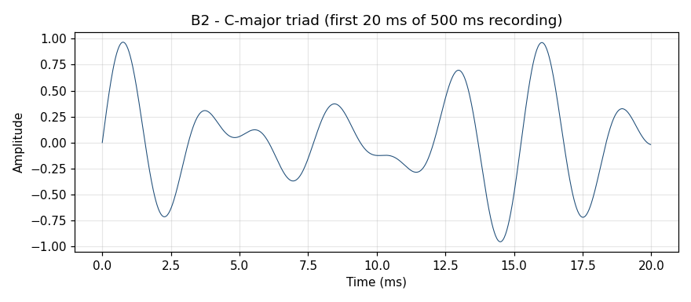
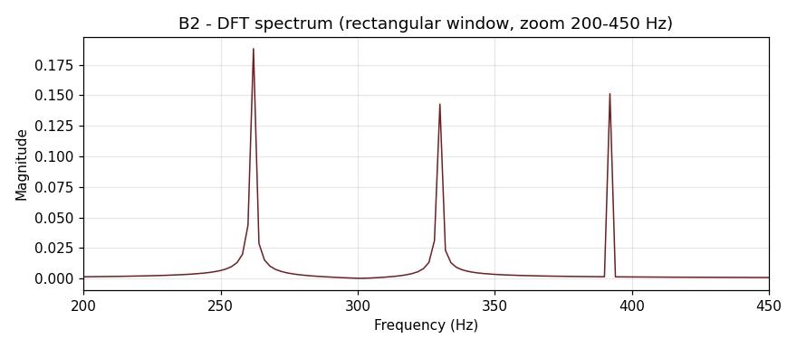
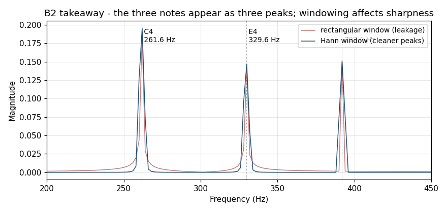

# B2 — Audio sample (a chord)

## The premise

The ear contains, in its innermost chamber, a structure called the basilar membrane — a roughly 35-millimetre spiral that is narrow and stiff at one end, wide and floppy at the other. Different frequencies cause different parts of it to resonate: high frequencies near the stiff end; low frequencies at the floppy end. The result is a spatial frequency map, read out along the spiral and reported, already decomposed, to the brain. The ear has been running this particular computation for approximately 50 million years, which is a considerable head start on the laboratory equipment¹.

(¹ The outer ear canal, eardrum, and three small bones upstream of the cochlea are the preprocessing chain; the basilar membrane does the frequency-sorting. The analogy to a DFT is imperfect but instructive — and the human version comes with a carry case and does not require a power supply.)

A chord is several of those frequencies arriving simultaneously, each staking a claim on a different portion of the membrane. The DFT is how we confirm — computationally, without the biology — which frequencies are present and at what relative strength. This chapter applies the same four-step pipeline as B1, but against a piece of audio with three notes in it. The spectrum will have three peaks. One of them, as it happens, will not land exactly where it should, and that small displacement will turn out to be rather informative.

This chapter does two things B1 didn't:

1. Multiple peaks at once.
2. **Spectral leakage**, and how a window function tames it.

## The input

`examples/shad/b2-audio/main.py` synthesises a C-major triad: C4 (261.63 Hz) + E4 (329.63 Hz) + G4 (392.00 Hz), summed at relative amplitudes 0.4, 0.3, 0.3, sampled at 44.1 kHz (CD quality) for 500 ms.



Twenty milliseconds of waveform shown — the full 500 ms would look like a solid black band. The pattern visible is the **beat** between the three notes: their frequencies aren't simple integer ratios, so the combined waveform doesn't perfectly repeat at a short interval. That's what gives music its perceived richness vs a single tone.

To the eye, the waveform looks like elegant chaos. It is three sinusoids, patiently coexisting — what the ear decodes automatically in milliseconds, the DFT will decode in microseconds, at the cost of four lines of Python.

## The transform — first pass, rectangular window

Same code as B1, except N is bigger: 22,050 samples instead of 500.

```python
n = samples.size                          # 22050
spec = np.fft.fft(samples) / n
freq = np.fft.fftfreq(n, d=1.0/44_100)
half = n // 2
freq, mag = freq[:half], np.abs(spec[:half])
```

Zoomed to 200–450 Hz (the range where the three notes live):



Three peaks. Good. But look closely at the C4 peak at 261.63 Hz: it has visible **side-lobes** spreading energy into neighbouring bins. The G4 at 392 Hz lands right on a bin (392.00 Hz × 22050 ÷ 44100 = 196.0, exact integer) and looks clean. The C4 and E4 don't land on integer bins, so their energy spreads.

This is **spectral leakage**. **Do not panic about this.** The name sounds as though something went wrong; nothing went wrong. What happened is that the DFT implicitly treats your 500 ms recording as one period of an infinitely-repeating signal — and if a frequency doesn't divide evenly into the recording length, the DFT sees a discontinuity at the boundaries, and that discontinuity smears energy into neighbouring bins. The signal is still there. The three notes are still identifiable. The leakage is the DFT being honest about the mismatch between the signal and its window — which is, as forms of honesty go, more diagnostic than most instruments manage.

## Windowing

The fix: multiply the input by a window function before transforming. The window tapers the signal smoothly to zero at both ends, which reduces the artifacts caused by the DFT implicitly treating your 500 ms recording as one period of an infinitely-repeating signal.

```python
n = samples.size
w = np.hanning(n)               # Hann window: 0 at ends, 1 in middle
x = samples * w
gain = w.sum() / n              # coherent gain compensation
spec = np.fft.fft(x) / (n * gain)
```

The `gain` factor compensates for the energy the window removed at the edges, so the peak heights still match the original tone amplitudes. The Hann window² tapers with a raised cosine — smooth enough to suppress most leakage without broadening the main peaks too badly.

(² Named for Julius von Hann, a 19th-century Austrian meteorologist who studied atmospheric pressure oscillations. The colloquial spelling "Hanning" is factually inexact but universally understood. Julius himself has no recorded opinion on the matter.)

## The takeaway



Two spectra overlaid:

- **Red** = rectangular window (no windowing). Side-lobes visible around each peak. Pretty for the on-bin G4, ugly for off-bin C4 and E4.
- **Blue** = Hann window. Peaks are slightly wider but **the noise between peaks drops dramatically**. The three notes stand out cleanly.

Which window to use is a domain-dependent choice. Hann is the default-good-choice for general analysis; Hamming is similar; Blackman gives narrower side-lobes at the cost of slightly wider main-lobe; rectangular is fine when your frequencies land exactly on integer bins (rare in real signals).

This is, in miniature, the central trade-off of spectral analysis: narrow peaks or low side-lobes — not both simultaneously. Every window function is a negotiation between these two quantities. The choice is a judgment call, not a theorem, which is either reassuring or alarming depending on your disposition toward ambiguity.

## What we just did

**Multiple peaks, with leakage.** This is what real-world spectra look like 95% of the time. The takeaway plot is what a music-analysis tool would show you for any chord. The same machinery applies to:

- Speech analysis (which formant frequencies are present in a vowel)
- Vibration monitoring (which rotation-rate harmonics show up — that's [B3](03-vibration.md))
- Radar / sonar (which Doppler-shifted reflectors are in your sight line)
- Any "spectrum analyser" hardware you've ever looked at
- Any signal sampled at regular intervals in time — which, depending on how broadly you read the word "signal", is most of the numerical data that has ever been collected

## Try it yourself

```bash
python examples/shad/b2-audio/main.py
```

Modify the `NOTE_FREQ` dictionary at the top of `main.py` to play different chords. Try minor triads (C4 + E♭4 + G4 = 261.63 + 311.13 + 392.00). Try dissonances (C4 + C♯4). Note how the spectrum reads exactly what you'd hear.

For real audio: the script's bottom has a sketch showing how to drop in any CC-licensed .wav from Wikimedia Commons or Freesound. The transform code is identical; only the data source changes.

## A note on FFT vs DFT

B1 and B2 use `np.fft.fft`, which is a **Fast Fourier Transform** — O(N log N) instead of the canonical-reference DFT's O(N²). For N=22050 that's the difference between ~316,000 operations and ~486,000,000 operations. The output is numerically identical to within IEEE-754 rounding for any N that's a power of 2 or 3 or 5 (the [Cooley-Tukey factorisations](../../shared/canonical-equations/fft-cooley-tukey.md) NumPy uses internally). For correctness understanding: the canonical Fortran/C++ reference in this repo is the slower direct evaluation; FFT lands in v0.3.0 of lege-artis/fourier as its own kernel + property P5 (`FFT ≡ DFT to floating-point precision`).

## Cross-references

- Cooley-Tukey FFT canonical formulation: [`../canonical/en/01-dft-definition.md`](../canonical/en/01-dft-definition.md) (section on FFT)
- Property tests including time-shift + Hermitian symmetry that explain *why* windowing works: [`../../shared/property-tests/dft.md`](../../shared/property-tests/dft.md)
- Engineer-tier worked example of the 4-sample case that shows leakage on a tiny input: [`../engineer/en/01-what-dft-actually-computes.md`](../engineer/en/01-what-dft-actually-computes.md)

---

**Next:** [B3 — Vibration / accelerometer](03-vibration.md)
**Previous:** [B1 — Oscilloscope](01-oscilloscope.md)
