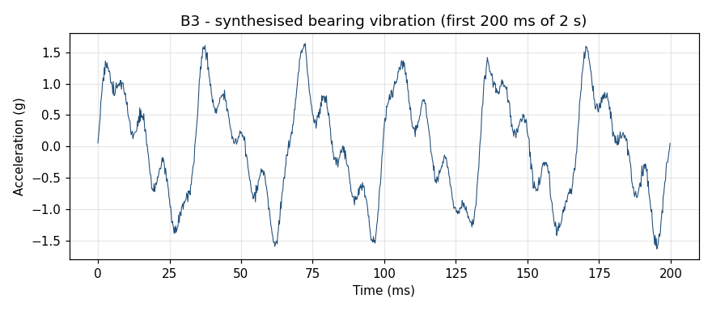
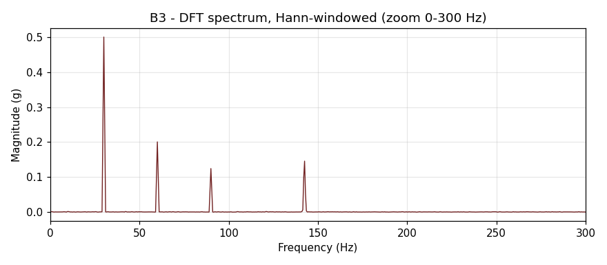
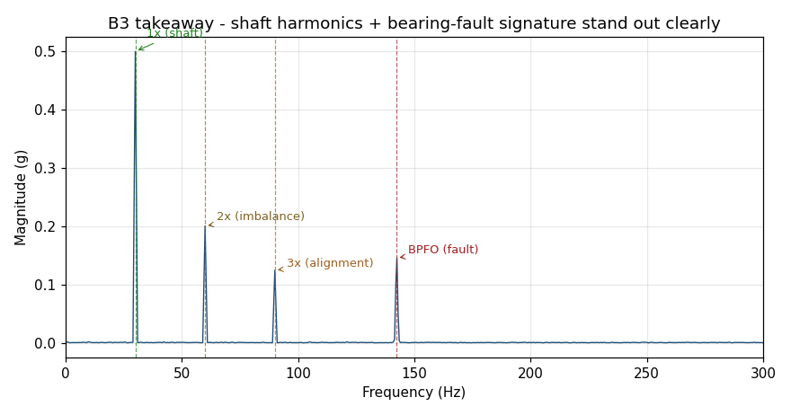

# B3 — Vibration / accelerometer

## The premise

B1 had a clean tone. B2 had a chord. **Real industrial machines don't produce clean tones.** A rotating bearing produces a fundamental shaft rate plus integer-multiple harmonics (imbalance, misalignment, looseness) plus non-integer features (bearing-fault signatures, gearmesh sidebands) plus a broadband noise floor.

A trained vibration engineer reads these spectra the way a doctor reads an ECG. This chapter shows you the basics.

## The setup

`examples/shad/b3-vibration/main.py` synthesises a 2-second accelerometer trace from a machine running at 1800 RPM (= 30 Hz shaft rate), sampled at 5 kHz. The synthetic signal contains:

| Feature | Frequency | Amplitude | What it means physically |
|---------|-----------|-----------|--------------------------|
| **1× (shaft)** | 30.0 Hz | 1.00 | The fundamental rotation rate |
| **2× (imbalance)** | 60.0 Hz | 0.40 | Mass imbalance on the rotor |
| **3× (alignment)** | 90.0 Hz | 0.25 | Coupling misalignment between shafts |
| **BPFO (fault)** | 142.4 Hz | 0.30 | Ball-pass frequency, outer race — incipient bearing fault |

Plus a white-noise floor at 5% amplitude.

The first three are *harmonics* of the shaft rate. The BPFO at 142.4 Hz is **not** an integer multiple of 30 Hz — it's determined by the bearing geometry (number of balls, ball diameter, pitch diameter, contact angle). On this bearing, the calculated BPFO is 4.746× shaft rate, giving 142.4 Hz at 30 Hz shaft.

## The input



First 200 ms shown. You can see the dominant 30 Hz rotation visually (about 6 full cycles in 200 ms). The smaller-amplitude features blend into a complex waveform — that's exactly why we need the spectrum to read what's going on.

## The transform — Hann-windowed

For real-world vibration data, you essentially *always* window. The data isn't periodic over your record length, so a rectangular window gives leakage that obscures the BPFO peak.

```python
n = samples.size                            # 10000 (5 kHz × 2 s)
w = np.hanning(n)
spec = np.fft.fft(samples * w) / (n * w.sum() / n)
freq = np.fft.fftfreq(n, d=1.0/5_000)
half = n // 2
freq, mag = freq[:half], np.abs(spec[:half])
```



Four distinct features visible in the 0–300 Hz range. Reading the spectrum:

## The takeaway — what a vibration engineer sees



**Diagnostic reading**, working through what the four peaks tell you:

1. **30 Hz (1×) dominant**: shaft is rotating, sensor is working, baseline established.
2. **60 Hz (2×) at 0.40× the 1×**: moderate **imbalance**. Typical for a machine in service; severity threshold for balancing is usually around 50% of 1× for general-purpose rotating equipment.
3. **90 Hz (3×) at 0.25×**: mild **alignment** issue. Often correctable by adjusting coupling shims.
4. **142.4 Hz (BPFO) at 0.30×**: this is the diagnostic concern. It's not a shaft harmonic — it's geometry-locked to the bearing. Its presence + amplitude means **incipient outer-race bearing damage**. Action: schedule bearing replacement at next maintenance window before failure becomes catastrophic.

This is the kind of analysis that turns spectrum plots into maintenance schedules. Every condition-monitoring system on the planet (SKF, Bently Nevada, GE/Bently, IFM, OEM custom solutions) is essentially doing what we just did: take samples, window, FFT, look up peaks against expected fault frequencies, report.

## What we just did

**Spectrum as diagnostic.** The spectral pattern carries more information than the time-domain trace because *each rotating-machinery failure mode has its own signature frequency*. Misalignment is always at integer harmonics. Bearing faults are always at one of the four ball-related frequencies (BPFO, BPFI, BSF, FTF). Gearmesh defects are always at the gearmesh frequency. Once you know the catalogue, the spectrum reads itself.

Vibration analysis is the most mature "spectrum is the answer" engineering domain — it's been the standard for predictive maintenance since the 1970s. The math you just learned in B1 and B2 is the *entirety* of the math behind a multi-billion-dollar industry's bread-and-butter analysis tool.

## Try it yourself

```bash
python examples/shad/b3-vibration/main.py
```

Modify the `HARMONICS` dict at the top of `main.py` to simulate different fault scenarios:

- Crank up `2x (imbalance)` to 1.5 → severe imbalance, dominant peak shifts from 1× to 2×.
- Add a new entry `"BPFI (inner race)": (235.2, 0.4)` → a different bearing fault.
- Reduce `1x (shaft)` to 0.3 and set noise_amp to 0.2 → a noisy machine with a small but persistent BPFO peak: the analyst's nightmare scenario where you need careful windowing to detect the fault buried in noise.

For real bearing-fault data, the NASA Bearing Dataset (CC-BY, on Kaggle) gives you actual accelerometer recordings of bearings run to failure. The transform pipeline above runs unchanged on that data — only `np.loadtxt(...)` instead of `synth_vibration(...)`.

## Where this goes next

The progression so far:

- **B1**: one tone, one peak. The math just works.
- **B2**: multiple tones, leakage, windowing. The math needs care.
- **B3**: real-machine signals with harmonics + fault signatures. The math is diagnostic.

**B4 (queued v0.2.x)** takes this to long records and broadband noise — geophysical signals where the periodic component is buried under decades of background fluctuation, and you need periodogram smoothing + averaging to surface it.

**B5 (queued v0.2.x)** goes to interferometry: EHT public data + LIGO open data. Same FFT machinery, bigger datasets, harder I/O, but the underlying spectrum-as-diagnostic intuition is exactly what we built here.

## Cross-references

- Property tests including Hermitian symmetry (real input → conjugate-symmetric spectrum): [`../../shared/property-tests/dft.md`](../../shared/property-tests/dft.md)
- Physics testbed PT-DFT-03B (spectral leakage on non-integer cosine): [`../../shared/physics-testbeds/dft.md`](../../shared/physics-testbeds/dft.md)
- Canonical-tier rigorous derivation of windowing: [`../canonical/en/`](../canonical/en/)

## On the bibliography

Vibration-spectrum analysis as a field is heavily documented in textbooks; the ones in [`../../shared/reference-bibliography/refs.bib`](../../shared/reference-bibliography/refs.bib) (Oppenheim-Schafer, Numerical Recipes) cover the DFT/FFT side. Specifically for condition-monitoring practice, the ISO 10816 family of standards and any "rotating machinery vibration" textbook (e.g. Vance / Murphy / Zeidan) gives you the diagnostic catalogue. We don't redistribute their content here; this guide gets you to the spectrum, the standards tell you what to do with it.

---

**Next:** B4 — Geophysical / long-record analysis *(queued v0.2.x)*
**Previous:** [B2 — Audio sample](02-audio.md)
