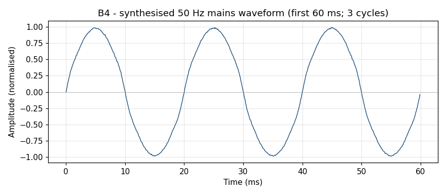
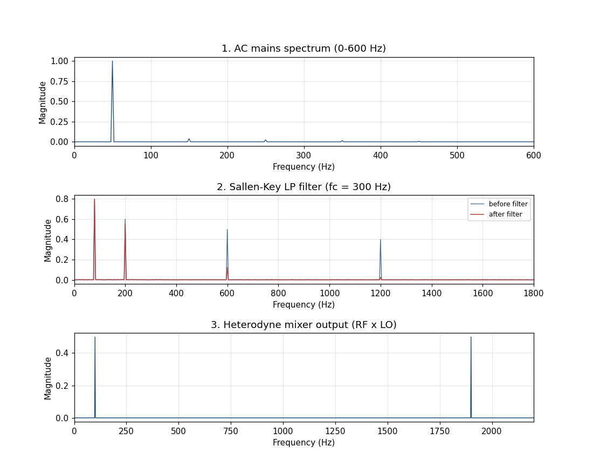
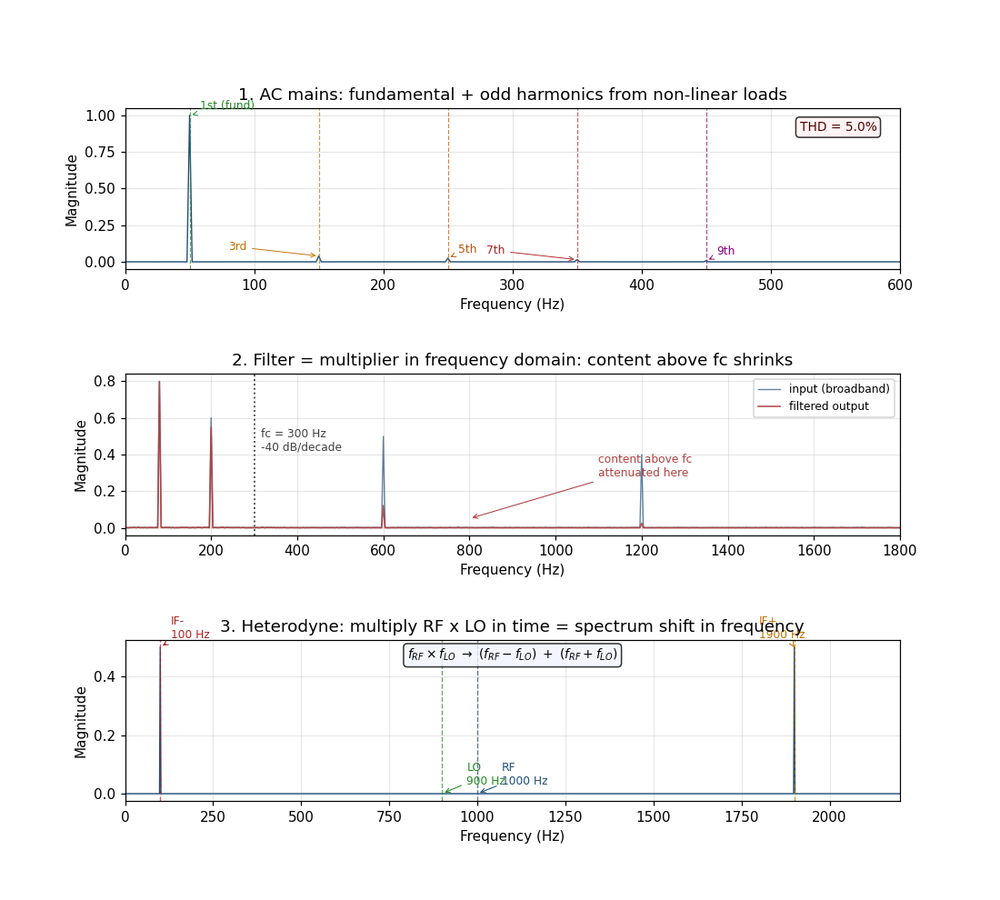

# B4 — Electronic systems

## The premise

B3 showed you a spectrum you could only *observe*. The machine was already
spinning; the fault was already there. Fourier handed you a picture.

**B4 is different.** In electronics, you actively *design* for frequency-domain
behaviour. A filter is literally defined by which frequencies it passes and
which it kills. A radio receiver is deliberately moving frequencies around. The
spectrum view is not a diagnostic aid here — it is the primary engineering
language.

Three sub-topics, each adding one layer to the same idea: active circuits change
the spectrum, and you can predict exactly how.

---

## 1. AC mains harmonics — what is actually in that socket?

### The setup

You probably learned that mains is a "50 Hz sine wave." It is not. Everything
you plug in that contains a rectifier (phone charger, computer power supply,
LED dimmer) draws current in narrow pulses rather than sinusoidally. That
non-linear current draw distorts the mains voltage, injecting energy at odd
harmonics of the 50 Hz fundamental.

`examples/shad/b4-electronic/main.py` synthesises a realistic mains waveform:

| Harmonic | Frequency | Relative amplitude | Source |
|----------|-----------|-------------------|--------|
| **1st (fundamental)** | 50 Hz | 1.000 | The line itself |
| **3rd** | 150 Hz | 0.040 | Single-phase rectifiers |
| **5th** | 250 Hz | 0.025 | Switching power supplies |
| **7th** | 350 Hz | 0.015 | Accumulated load mix |
| **9th** | 450 Hz | 0.008 | Distributed building load |

Total Harmonic Distortion: **THD = 5.0%** — typical residential grid.

### The input



Three cycles of 50 Hz mains. The distortion from harmonics is visible as a
slight flattening near each peak — not dramatic, but measurable. This is the
signal arriving at your equipment's input terminals every day.

### The spectrum



Top panel: mains spectrum, 0–600 Hz. Five peaks. The fundamental at 50 Hz
dominates; the odd harmonics fall off to the right. The 9th harmonic (450 Hz)
is barely visible at 0.8% amplitude — but it is there, and it matters in
sensitive measurement equipment.

### The takeaway



**Panel 1 — reading the mains spectrum like a power quality engineer:**

The standard metric is **THD** (Total Harmonic Distortion):

```
THD = sqrt(V_3^2 + V_5^2 + V_7^2 + V_9^2 + ...) / V_1
```

IEEE 519-2022 sets acceptable THD limits for industrial and utility
interconnections: typically < 5% THD-V at the point of common coupling for
most industrial systems, < 8% for some distribution-level buses.

A THD above these thresholds has measurable consequences:
- **Motor heating**: motors see voltages that produce torque at all harmonic
  frequencies; the harmonics mostly produce heat, not useful torque.
- **Transformer derating**: the additional copper and core losses from
  harmonics require a de-rating factor K, typically K = 0.85–0.95 for a
  moderately distorted supply.
- **EMC pre-compliance**: every product sold in the EU must pass IEC 61000-3-2
  (limits on harmonic current drawn from the mains). The measurement is just
  an FFT of the input current waveform, checked against a published table.
  That compliance test *is* what we just computed.

---

## 2. Active filter — filtering IS multiplication in frequency

### The setup

The goal: suppress the 5th, 7th, and 9th mains harmonics from a sensitive
analogue measurement circuit. You install a 2nd-order Sallen-Key low-pass
filter with a cutoff at 300 Hz.

The Sallen-Key transfer function (normalised LP):

```
H(f) = 1 / (1 + j*(f/fc)/Q - (f/fc)^2)
```

For a Butterworth (maximally flat) response: Q = 1/sqrt(2) = 0.707.
Above the cutoff the response rolls off at −40 dB/decade (factor of 100 in
power per decade of frequency).

The script applies this filter entirely in the frequency domain: compute the
FFT of the input, multiply by H(f), inverse-FFT back to time. This is not a
trick — it is exactly what the physical capacitors and op-amp are doing, just
described in different notation.

### The spectrum (panel 2 of the figure)

The middle panel of both figures shows the test signal (broadband: tones at
80, 200, 600, and 1200 Hz plus noise) before and after the filter.

**Before:** four peaks of roughly similar amplitude, spread across 0–1800 Hz.

**After:** the 80 Hz and 200 Hz tones survive nearly intact (they are inside
the passband); the 600 Hz and 1200 Hz tones are strongly attenuated. The noise
floor above ~500 Hz has collapsed.

### The takeaway (panel 2 annotated)

The annotation marks the 300 Hz cutoff with a dashed line and labels the
attenuation region. The key engineering intuition:

> **A filter is a multiplier in the frequency domain.** Each frequency bin
> of the input spectrum is multiplied by |H(f)| — near 1.0 inside the passband,
> near 0 far above cutoff. There is no mystery about "where the energy went."
> It was multiplied by a very small number.

The −40 dB/decade slope of a 2nd-order Butterworth filter means that a tone
at 10× the cutoff frequency (3000 Hz in our case) is attenuated by a factor of
100 in voltage (40 dB). At 100× the cutoff it is attenuated by 10,000× (80 dB).
Each additional filter order adds another −20 dB/decade to the rolloff — hence
the preference for higher-order filters in demanding EMC applications.

---

## 3. Heterodyne mixer — shifting the spectrum

### The setup

A superheterodyne receiver (every AM radio, FM radio, and most SDR dongles
uses this principle) wants to shift an incoming RF signal at an arbitrary
frequency down to a fixed intermediate frequency (IF) where it can be filtered
and amplified efficiently.

The mechanism: **multiply the RF signal by a local oscillator (LO) in the time
domain.** Trigonometric identity:

```
sin(2*pi*f_RF*t) * sin(2*pi*f_LO*t)
    = 0.5 * [cos(2*pi*(f_RF - f_LO)*t) - cos(2*pi*(f_RF + f_LO)*t)]
```

The product produces two new frequencies: the **difference** (RF − LO) and the
**sum** (RF + LO). In a receiver, you choose LO so that the difference falls
at a convenient IF; you then filter out the sum.

The script uses:
- RF = 1000 Hz (simulated carrier)
- LO =  900 Hz (local oscillator)
- IF− = RF − LO = **100 Hz** (this is the desired output channel)
- IF+ = RF + LO = **1900 Hz** (this is the image, filtered out)

### The spectrum (panel 3)

Bottom panel: the mixer output spectrum, 0–2200 Hz. The RF input and LO input
are present (they leak through in a real mixer; here they appear because we
synthesise the product of two real sinusoids). The two new peaks at 100 Hz and
1900 Hz are clearly visible, with equal amplitude — as the trigonometric
identity predicts.

### The takeaway (panel 3 annotated)

**Reading the mixer output spectrum:**

1. **100 Hz (IF−)**: this is the signal you want. A bandpass filter centred at
   100 Hz would isolate it cleanly. In a real radio, this is the audio or
   baseband channel.
2. **900 Hz (LO)**: the local oscillator leaks through. In a well-designed
   mixer IC the LO-to-output isolation is 30–50 dB; visible here because our
   ideal multiplication has no isolation at all.
3. **1000 Hz (RF)**: the RF input also leaks. Same comment.
4. **1900 Hz (IF+)**: the unwanted image. Filtered by the IF filter (a BP
   centred on 100 Hz would kill it; it's 1800 Hz away).

Why does this matter beyond radios? The same heterodyne principle appears in:
- **Lock-in amplifiers**: detect a weak signal buried in noise by multiplying
  with a reference oscillator at the exact signal frequency, shifting it to
  DC where a low-pass filter removes all other noise.
- **Optical coherence tomography (OCT)**: the depth information is encoded in
  the beat frequency between a sample arm and a reference arm — a heterodyne
  in the optical domain.
- **Software-defined radio (SDR)**: the RTL-SDR dongle you can buy for €20
  does exactly this in silicon at GHz frequencies.

---

## What we just did

Three sub-topics, one unifying claim: **the spectrum is the primary design
language for active circuits.**

An oscilloscope shows you what happened. A spectrum analyser shows you what
will happen if you add a filter, swap a component, or mix in an oscillator. The
difference between B3 (observation) and B4 (design) is the difference between
diagnosis and engineering.

B5 takes this one step further: Doppler radar uses the heterodyne principle to
measure velocity, not just frequency. The spectrum of the returned pulse tells
you not just what frequency was transmitted, but how fast the target is moving.

---

## References

- A. Sedra and K. Smith, *Microelectronic Circuits*, 8th ed., Oxford University
  Press, 2014. §12.2 (Sallen-Key topology + active filter design).
  ISBN 978-0-19-933918-8.

- B. Razavi, *RF Microelectronics*, 2nd ed., Prentice Hall, 2011. §2.3 (mixers
  and heterodyne receivers). ISBN 978-0-13-272914-9.

- IEEE Standard 519-2022, *IEEE Standard for Harmonic Control in Electric Power
  Systems*, IEEE, 2022. doi: 10.1109/IEEESTD.2022.9848440. (THD limits and
  measurement methodology.)
