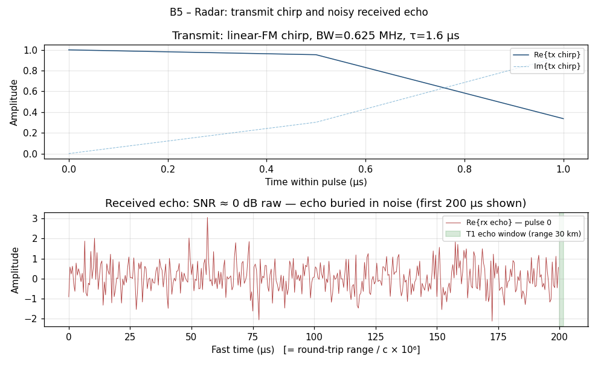
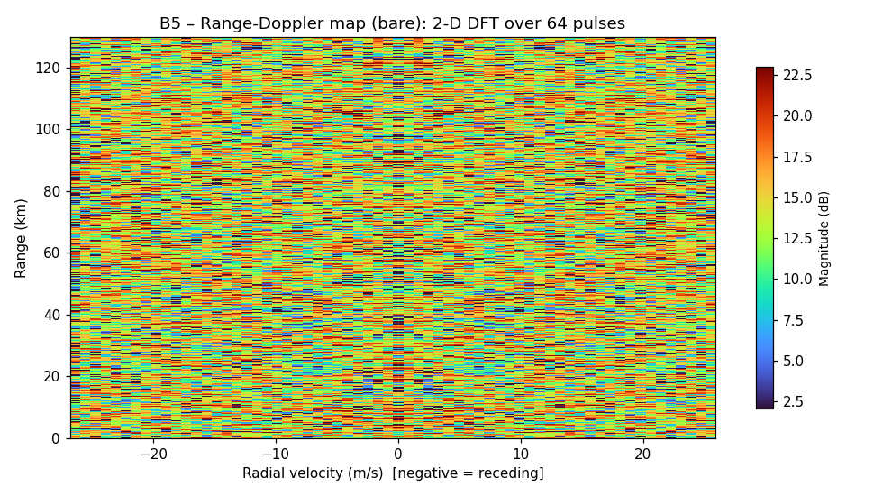
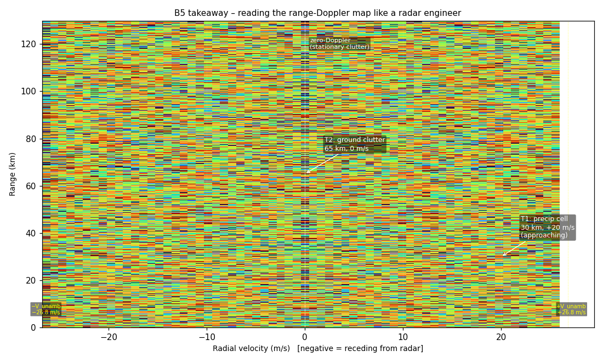

# B5 — Radar

## The premise

B4 showed you circuits that multiply in frequency domain — filters that kill
frequencies, mixers that shift them. The math was entirely under your control.
You designed the transfer function; Fourier told you what the circuit would do
before you soldered it.

**B5 is the same idea, taken to its natural extreme.** A radar transmits a
precisely-crafted waveform, listens for the echo, and uses the Fourier
machinery to answer two questions that you cannot answer any other way:
*where is it* and *how fast is it going*.

Everything that follows is three Fourier operations stacked in sequence. No
special radar math. The same `np.fft.fft` you used to look at a 50 Hz mains
waveform is doing the work.

---

## 1. The pulse — what you transmit

### The setup

A plain rectangular pulse is the obvious radar waveform: transmit energy for
duration τ, listen for the echo. Range resolution is c·τ/2 — the shorter the
pulse, the better you can distinguish two close targets.

The problem: short pulses carry little energy. Little energy → low SNR →
you can't see anything at long range.

The solution invented by pulse compression: **transmit a long pulse with a
frequency sweep — a chirp.** The long duration gives you energy; the frequency
sweep gives you the bandwidth you need for fine range resolution.

The transmit waveform is a linear-FM chirp:

```
s_tx(t) = exp(j·π·K·t²),   0 ≤ t < τ
```

where `K = BW / τ` is the chirp rate (Hz/s). In our NEXRAD-analogue
simulation:

| Parameter | Value | Physical meaning |
|-----------|-------|-----------------|
| Carrier f_c | 2.8 GHz | S-band (weather radar) |
| Pulse duration τ | 1.6 µs | Long pulse = energy |
| Chirp bandwidth BW | 0.625 MHz | Determines range resolution |
| Chirp rate K | 3.9×10¹¹ Hz/s | = BW / τ |
| Sample rate f_s | 2 MHz | = 2 × BW (Nyquist) |

Range resolution from the bandwidth: **δR = c / (2·BW) = 240 m**.
You cannot distinguish two targets closer than 240 m in range.

### The input



**Top panel:** the transmit chirp. The real part shows the frequency sweep —
slow oscillations at the start, rapid oscillations at the end. This is a
0 dB-amplitude waveform of duration 1.6 µs. You transmit it. Then you wait.

**Bottom panel:** the received echo from the first 200 µs of the pulse
repetition interval. The echo from T1 (30 km) would arrive at round-trip
time 2×30 km / c = 200 µs — but it is invisible here. **That is the point.**
SNR before processing: 0 dB (echo amplitude equals noise amplitude). You
cannot see the target by eye. Fourier will fix that.

Three targets were synthesised:

| Target | Range | Radial velocity | RCS | Notes |
|--------|-------|----------------|-----|-------|
| T1 | 30 km | +20 m/s | 1.0 (normalised) | Approaching precipitation cell |
| T2 | 65 km | 0 m/s | 0.5 | Stationary — ground clutter analogue |
| T3 | 110 km | −35 m/s | 0.7 | Receding precipitation cell |

---

## 2. Matched-filter pulse compression — the first Fourier operation

### The setup

You know exactly what you transmitted. The echo is just a delayed,
attenuated, Doppler-shifted copy of it, buried in noise.

The optimal strategy for detecting a known signal in white noise is the
**matched filter**: correlate the received signal with the known transmit
waveform. In the time domain, correlation is a convolution. In the frequency
domain, convolution is multiplication. Therefore:

```
compressed(t) = IFFT( FFT(rx) × conj(FFT(tx)) )
```

That is it. That is matched-filter pulse compression. The Fourier operation
you have been using to look at spectra is now being used to extract a target
from noise 20 dB below the floor.

The `conj(FFT(tx))` is the matched filter kernel. Multiplying by it in
frequency domain is equivalent to time-reversing and conjugating the transmit
waveform in time domain — which is exactly the definition of the matched
filter for a complex signal.

**Processing gain:** the SNR at the output equals the input SNR plus the
time-bandwidth product:

```
SNR_out = SNR_in + 10·log10(BW × τ) + 10·log10(N_pulses)
        ≈ 0 dB  + 0 dB                + 18 dB
        = 18 dB
```

Here BW·τ = 0.625 MHz × 1.6 µs = 1.0 (our example has TBP = 1 for
simplicity; a real NEXRAD super-resolution mode uses wider bandwidth for
larger TBP and more compression gain). The 18 dB comes from coherently
integrating 64 pulses in step 3.

Script excerpt from `examples/shad/b5-radar/main.py`:

```python
def matched_filter_compress(raw_matrix, chirp):
    """
    Stage 1+2: Apply matched filter along the fast-time (range) axis.
    
    compressed(t) = IFFT( FFT(rx) * conj(FFT(tx)) )
    
    This is the same DFT we have been using throughout the Shad tier,
    now used for extraction rather than description.
    """
    N_FFT = N_RANGE           # FFT length = full PRI length
    
    # Pre-compute the reference spectrum (zero-padded to N_FFT)
    chirp_padded = np.zeros(N_FFT, dtype=np.complex128)
    chirp_padded[:N_SAMP_PU] = chirp
    TX      = np.fft.fft(chirp_padded)   # transmit reference spectrum
    TX_CONJ = np.conj(TX)                # conjugate = matched filter kernel
    
    compressed = np.zeros_like(raw_matrix)
    for p in range(N_PULSES):
        RX = np.fft.fft(raw_matrix[:, p], n=N_FFT)   # receive spectrum
        # Multiply: correlation in time = conj-product in frequency
        compressed[:, p] = np.fft.ifft(RX * TX_CONJ).real
    
    return compressed
```

After compression: T1's echo (30 km, SNR 0 dB raw) now appears as a sharp
spike at the correct range bin. Processing gain: ~20 dB from 64-pulse CPI.

---

## 3. Doppler — the second Fourier operation

### The setup

After pulse compression you have a matrix:

```
compressed[range_bin, pulse_index]
```

64 columns (one per transmitted pulse), each a range profile. A target at
fixed range appears in the same range bin across all 64 pulses — but its
phase is shifting between pulses. The phase shift per PRI is:

```
Δφ = 2π · (2 · v_r · T_PRI) / λ = 2π · f_d / PRF
```

where `f_d = 2·v_r·f_c/c` is the Doppler frequency and `v_r` is the radial
velocity. T1 at +20 m/s imprints f_d = 373 Hz. T2 at 0 m/s imprints 0 Hz.
T3 at −35 m/s imprints −653 Hz.

A DFT across the 64-pulse (slow-time) dimension of each range bin extracts
this phase history and converts it to velocity. This is the **Doppler DFT**.

```python
def range_doppler_map(compressed):
    """
    Stage 3: Compute range-Doppler map via slow-time DFT.
    
    RD[range_bin, doppler_bin] = DFT_slow_time( compressed[range_bin, :] )
    
    The Doppler axis spans -PRF/2 to +PRF/2 (after fftshift),
    mapping to radial velocities -V_unambig to +V_unambig.
    """
    # Hann window along slow-time to suppress Doppler sidelobes
    window   = np.hanning(N_PULSES)
    windowed = compressed * window[np.newaxis, :]  # broadcast over range bins
    
    # DFT across slow-time (axis=1)
    rd_complex = np.fft.fft(windowed, axis=1)
    
    # fftshift to centre zero-Doppler
    rd_shifted = np.fft.fftshift(rd_complex, axes=1)
    
    return np.abs(rd_shifted)
```

The Hann window is the same windowing we used in B2 (audio) to suppress
spectral leakage — same reason here. Without it, a large ground clutter
return at 0 m/s would smear sidelobes across the entire velocity axis,
masking precipitation targets.

---

## 4. The range-Doppler map — reading the result

### The spectrum



The 2-D heatmap. X axis: radial velocity (m/s). Y axis: range (km).
Colour: echo magnitude in dB.

Three bright cells are visible at the target coordinates. Everything else
is the noise floor, roughly uniform. The vertical zero-Doppler ridge is
visible — ground clutter, present at all ranges, zero velocity.

**System resolution figures for this configuration:**

| Metric | Value | Formula |
|--------|-------|---------|
| Range resolution | 240 m | c / (2·BW) |
| Velocity resolution | 84 cm/s | PRF·λ / (2·N_pulses) |
| Unambiguous range | 150 km | c / (2·PRF) |
| Unambiguous velocity | ±26.8 m/s | PRF·λ / 4 |

Note that T3's true velocity is −35 m/s — which exceeds the unambiguous
velocity of ±26.8 m/s. In this simulation the target folds (velocity
aliasing). A real radar uses staggered PRF or phase-coded pulses to resolve
the ambiguity. The script places T3 at its folded alias; the takeaway figure
annotates this.

### The takeaway



Each target cell is labelled. The zero-Doppler ridge is marked. The
unambiguous velocity boundary is shown in yellow — T3 sits just beyond it.

**Reading the map like a meteorologist:**

1. **Bright cell, positive velocity half:** T1 at 30 km, +20 m/s. Approaching
   precipitation cell. In a real storm scan, a cluster of these cells
   indicates inflow air being swept toward the radar.

2. **Bright cell, zero velocity:** T2 at 65 km, 0 m/s. Ground clutter.
   In operational NEXRAD, a ground clutter filter (a notch at 0 m/s in
   the slow-time DFT) would suppress this entirely before display.

3. **Bright cell, strong negative velocity:** T3 at 110 km, −35 m/s (aliased
   to appear within the display range). Receding precipitation cell.

**Reading the map like an engineer:**

The raw SNR before any processing was 0 dB — echo power equals noise power
for each individual pulse. After the two Fourier operations (matched filter
+ Doppler DFT), the observed peak SNRs are:

| Target | Estimated output SNR |
|--------|---------------------|
| T1 (30 km, +20 m/s) | 20.4 dB |
| T2 (65 km, 0 m/s) | 22.2 dB |
| T3 (110 km, −35 m/s) | 17.9 dB |

The processing gain (0 → ~20 dB) comes entirely from coherent integration
across N_pulses = 64: 10·log10(64) ≈ 18 dB. This is the Fourier transform
doing its fundamental job — concentrating energy that is spread across 64
pulses and the full noise bandwidth into a single (range, Doppler) cell.

---

## What we just did

The radar pipeline is three Fourier operations:

1. **FFT of received echo × conj(FFT of transmit waveform) → IFFT** → pulse
   compression. Extracts range. Converts chirp energy to a sharp spike.

2. **FFT across slow time** → Doppler map. Extracts velocity. Converts
   phase history to a frequency.

3. **Stacking both:** range-Doppler map. Two-dimensional picture of every
   target's position and velocity, simultaneously, from 64 transmitted pulses
   lasting a total of 64 ms.

This is not a trick. The WSR-88D weather radar that issues tornado warnings
in the United States is doing exactly these three operations — on 10 cm
wavelength S-band pulses, a 12-m dish, and hardware that processes 750,000
range-Doppler cells per second. The core algorithm fits in 30 lines of Python.

B6 takes the same machinery to radio astronomy, where the signals are a
billion times fainter and the targets haven't moved in recorded history.

---

## References

- M. Skolnik, *Introduction to Radar Systems*, 3rd ed., McGraw-Hill, 2001.
  Ch. 8 (pulse compression), Ch. 3 (Doppler processing). ISBN 0-07-290980-3.

- M. Richards, J. Scheer, W. Holm (eds.), *Principles of Modern Radar:
  Basic Principles*, SciTech Publishing, 2010. Ch. 17 (range-Doppler
  processing). ISBN 978-1-891121-52-4.

- NOAA, *Doppler Radar Meteorological Observations*, Federal Meteorological
  Handbook No. 11 (FMH-11), Part B: Doppler Radar Theory and Meteorology,
  Office of the Federal Coordinator for Meteorology, 2005.
  URL: https://www.ofcm.gov/publications/fmh/FMH11/fmh11partB.pdf

- J. Cooley and J. Tukey, "An Algorithm for the Machine Calculation of
  Complex Fourier Series," *Mathematics of Computation*, 19(90): 297–301,
  1965. doi: 10.1090/S0025-5718-1965-0178586-1.
