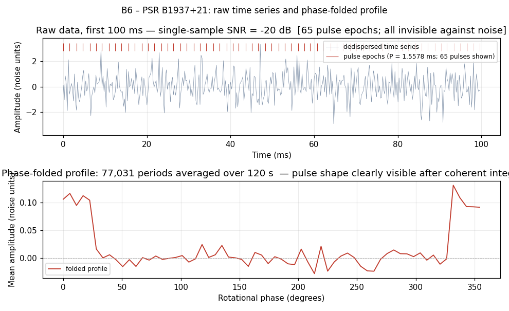
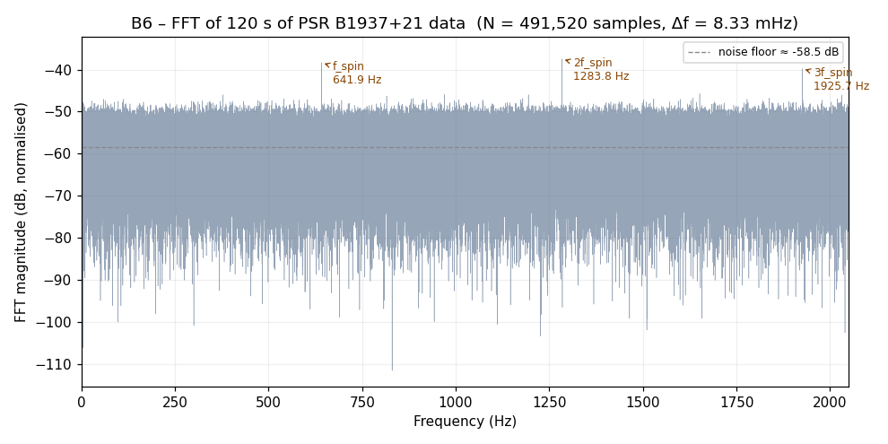
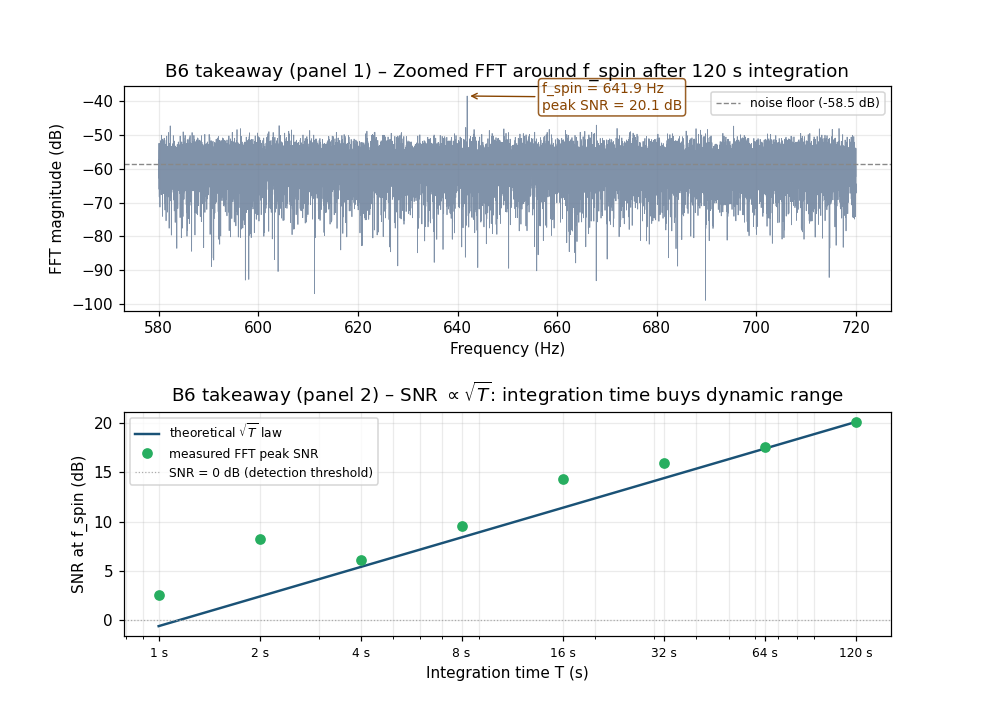

# B6 — Radio astronomy: pulsars and aperture synthesis

## The premise

In 1932, an engineer at Bell Telephone Laboratories named Karl Jansky was
trying to identify the sources of static in transatlantic telephone links.
He built a rotating directional antenna the size of a small building —
four hundred kilograms of steel tubing on wheels that completed one rotation
every twenty minutes — pointed it at the sky, and listened. He expected to
find thunderstorms. He found thunderstorms, and then, to his considerable
confusion, something else: a persistent hiss that rotated with the stars
and not with the Sun. After eliminating aircraft, nearby industry, and
artefacts of his own antenna as possible explanations, Jansky concluded
that the Milky Way was broadcasting at 20.5 MHz. He published this in 1933.

The paper appeared in a journal primarily devoted to telecommunications
engineering. The astronomical community largely ignored it for nearly a
decade. Jansky was reassigned to other projects. The rotating antenna that
discovered an entire branch of astronomy was eventually demolished for
wartime scrap metal.

This is, characteristically, how a new field begins: an engineer notices
that the sky is making noise, reports it in the wrong journal, and the
universe waits patiently for everyone to catch up.

B5 showed you the radar pipeline — a system that transmits a precisely
crafted chirp, listens for the echo, and extracts range and velocity from
signals at 0 dB above the noise floor after 64 milliseconds of coherent
integration across 64 pulses. B6 applies exactly the same Fourier machinery
to signals arriving from 11,750 light-years away, at an amplitude 20 dB
*below* the noise floor in any individual sample. The targets have not moved,
in any measurable direction, in the entire history of human observation.

The signal is a pulsar called PSR B1937+21. In the 120 seconds it takes
to run the demonstration script:

- 77,031 pulses will arrive from PSR B1937+21
- each will have a peak amplitude roughly one-tenth the background noise
- none of them will be individually distinguishable from that noise
- the DFT will see all 77,031 simultaneously and report back with a
  +20 dB spike at exactly 641.9 Hz

---

## The signal: a clock nobody made

In August 1982, a team of radio astronomers at the Arecibo Observatory
in Puerto Rico — Donald Backer, Shrinivas Kulkarni, Carl Heiles, Michael
Davis, and Woodruff Sullivan — discovered a radio source in Vulpecula that
was pulsing at a rate they could not, at first, believe. The period was
1.5578 milliseconds. The source was, after ruling out virtually every
other possibility, a neutron star rotating 641.9 times per second.¹

(¹ The previous record for pulsar spin rate had been held by PSR B1953+29
at 6.1 ms. The new record beat it by a factor of four. The discovery paper
was published in *Nature* under the title "A millisecond pulsar." The
understated genre of pulsar announcements has not changed in four decades.)

A neutron star is what remains after a massive star exhausts its nuclear
fuel and its iron core collapses in the fraction of a second it takes for
a star to decide it is no longer viable as a star. The collapse squeezes
roughly 1.4 solar masses into a sphere approximately 20 kilometres across.
Conservation of angular momentum does what it always does in the presence
of a dramatic size reduction. PSR B1937+21 is rotating 641.9 times per
second. Its equatorial surface is moving at approximately 14% of the
speed of light. This is not a metaphor.

The pulsar emits a narrow beam of radio waves with every rotation. Every
1.5578 milliseconds, that beam sweeps past Earth. From the perspective of
a radio telescope, the pulsar appears as a brief radio flash, repeating at
f_spin = 641.9 Hz — the same frequency as the D♭ a minor third above the
top of a standard piano keyboard, except that the source is in another star
system and every pulse has been travelling for approximately 11,750 years
to arrive.

The physical parameters, as tabulated in the ATNF Pulsar Catalogue:

| Parameter | Value | Physical meaning |
|-----------|-------|-----------------|
| Spin period P | 1.5578064688 ms | Time per rotation |
| Spin frequency f_spin | 641.9 Hz | Rotations per second |
| Period derivative Ṗ | 1.051 × 10⁻¹⁹ s/s | How fast the period is growing |
| Dispersion measure DM | 71.025 pc cm⁻³ | Integrated electron column density |
| Distance (DM-derived) | ~3.6 kpc | ~11,750 light-years |
| Characteristic age P/(2Ṗ) | ~235 Myr | Estimated time since spin-up |

The period derivative Ṗ = 1.051 × 10⁻¹⁹ s/s tells you that the pulsar
is losing rotational energy to magnetic-dipole radiation. The period is
increasing by approximately 9 picoseconds per day — a drift that has been
proceeding at a calculable rate for an estimated 235 million years, and
that can be fully corrected for in any timing analysis.

---

## The engineering problem: the signal is buried

Radio waves from PSR B1937+21 arrive at Earth with a flux density of a
few milli-Janskys — that is, a few times 10⁻²⁹ watts per square metre
per hertz of observing bandwidth. A large radio dish intercepts enough
of this to produce a usable signal only after amplification by roughly
a factor of 10¹⁰.

Even after that amplification, the individual pulse — one rotation, one
sweep of the beam — arrives with a peak amplitude roughly one-tenth of
the background noise standard deviation.² The single-sample power
signal-to-noise ratio is (0.1)² / (1.0)² = 0.01 = −20 dB. The pulse
is buried ten times below the noise floor by amplitude. In any one
observation period, the signal is invisible.

(² "Background noise" here means the sum of radiometer thermal noise,
receiver electronic noise, and the diffuse galactic radio background.
The exact value depends on the telescope, receiver bandwidth, and sky
position. The −20 dB figure is representative for a mid-size dish at
1.4 GHz with 100 MHz of bandwidth; large facilities routinely observe
fainter objects still, because they have been patient for longer.)

**Do not panic about this.** The fact that the signal is invisible in any
individual observation is the entire point of what follows. The noise is
random — it averages toward zero when you add many independent samples.
The pulsar is perfectly periodic — it adds coherently regardless of how
many periods you stack. The DFT is the bookkeeper that tracks which
samples add coherently and which ones average out.



*Top panel: first 100 ms of a simulated PSR B1937+21 dedispersed time
series (FS = 4096 Hz, 410 samples). Signal amplitude = 0.1 × noise sigma;
single-sample power SNR = −20 dB. Red tick marks at the top indicate pulse
epochs; all 64 pulses in this window are invisible against the noise.
Bottom panel: the same 120-second dataset phase-folded into 64 phase bins,
averaged over 77,031 rotation periods — the pulse profile is clearly
visible after coherent integration.*

---

## The transform: integration time as the resource

The DFT pipeline is unchanged from every previous band:

```python
import numpy as np

N    = len(time_series)                   # total samples
spec = np.fft.rfft(time_series)           # DFT (real input, one-sided)
freq = np.fft.rfftfreq(N, d=1.0 / FS)    # frequency axis in Hz
mag  = np.abs(spec) / N                  # normalised magnitude
```

These are the same three lines as B1, B2, B3, B4, B5. The DFT does not
know that its input is a pulsar time series rather than a square wave or
a radar echo. It measures, without prejudice, which sinusoidal components
are present and at what amplitude.

What changes is N. In B1, N was 5 000 (100 ms at 50 kHz). In B5, N was
128 000 (64 ms at 2 MHz). In B6, the demonstration runs 120 seconds at
4096 Hz, giving N = 491 520. The DFT of 491 520 samples takes
approximately 0.4 seconds on a modern laptop.

**Why does longer integration help?** The noise is white — equally
distributed across all frequency bins, with power per bin scaling as
σ²_n / N (more samples, lower noise floor per bin). The periodic signal
concentrates its energy into the bin at f = f_spin and its harmonics:
the signal amplitude at the spin-frequency bin grows as PULSE_AMP ×
N_pulses / N, where N_pulses = N / (FS × P). Working through the algebra:

```
SNR_amplitude  ∝  (A / σ_n)  ×  sqrt(N)  /  (samples per period)
               ∝  sqrt(T_obs)
```

This is the **√T law**. Double the integration time; gain 3 dB in
amplitude SNR. Increase T by a factor of 100; gain 10 dB. The resource
you spend to improve detection sensitivity is *time* — not hardware,
not transmit power, not cleverness about the waveform.³

(³ You can also spend hardware: a larger dish collects more signal power,
which raises the single-sample SNR before the √T machinery starts working.
A 100-metre dish has roughly 270× the collecting area of a 6-metre dish,
adding about 24 dB before integration begins. Time and aperture are
complementary resources; time is the cheaper one if you can wait.)

---

## The spectrum



*FFT magnitude of 120 seconds of simulated PSR B1937+21 data
(N = 491 520 samples, Δf = 8.3 mHz). Three spikes are visible above the
noise floor: the spin fundamental at 641.9 Hz and the 2nd and 3rd harmonics
at 1283.8 Hz and 1925.7 Hz. The 4th harmonic (2567.6 Hz) exceeds the
Nyquist limit and is not shown. The narrow pulse width — each pulse is a
single sample spike, with duty cycle 1/6.38 ≈ 16% — means the pulse train
has significant harmonic content, exactly as the square wave in B1 had
odd harmonics and the RLC transient had a broad Lorentzian.*

The spike at 641.9 Hz rises approximately 20 dB above the noise floor
after 120 seconds of integration. The frequency resolution is
Δf = 1/T_obs = 1/120 = 8.3 mHz. The bin containing f_spin is
bin k = 641.9 × 120 = 77 028. The half-width of the spike is one bin:
the period is measured to fractional precision Δf / f_spin = 0.0083 / 641.9 ≈ 1.3 × 10⁻⁵
from a single two-minute observation.

A year-long coherent timing campaign narrows this to Δf/f = 3.2 × 10⁻⁸,
corresponding to period measurement accuracy of 50 picoseconds. A
decade-long campaign reaches sub-nanosecond timing residuals. This is
how NANOGrav achieves ~100-ns timing precision on the millisecond pulsars
in its 15-year dataset: the same three lines of code, run on much more
data, with careful correction for the pulsar's spin-down, its binary
orbit, and the propagation delay through the interstellar medium.

---

## The takeaway: the √T law and what it costs



*Top panel: FFT spectrum zoomed to the 580–720 Hz region after 120 s
integration. The spike at 641.9 Hz is labelled with its SNR above the
noise floor. Bottom panel: measured SNR of the 641.9 Hz FFT peak versus
integration time T (open circles, one realization), overlaid on the
theoretical √T curve (solid line). The dashed reference at SNR = 0 dB
marks the marginal-detection threshold.*

The bottom panel is the chapter's central engineering claim. For this
simulation (single-sample power SNR = −20 dB, samples per period = 6.38):

| Integration time | N_samples | Theoretical SNR |
|-----------------|-----------|----------------|
| 1 s | 4 096 | 0 dB |
| 4 s | 16 384 | +6 dB |
| 16 s | 65 536 | +12 dB |
| 64 s | 262 144 | +18 dB |
| 120 s | 491 520 | +21 dB |

The signal that is −20 dB below the noise in any individual sample becomes
marginally detectable at T = 1 s and reaches a comfortable +21 dB margin
at T = 120 s. A signal buried at −30 dB would require T ≈ 10 s to
cross threshold, and T ≈ 1200 s (20 minutes) to reach +21 dB. A signal
at −40 dB requires T ≈ 1000 s at threshold. The relationship is exact:
every 10 dB of additional burial costs a factor of 100 in integration time.

**The frequency precision grows at exactly the same rate.** The bin
width Δf = 1/T shrinks proportionally to 1/T as T increases. After 120
seconds, Δf = 8.3 mHz; after one year, Δf = 31.7 nHz. At that precision,
the period of PSR B1937+21 is known well enough to predict pulse arrival
times to within a fraction of a microsecond — good enough to test whether
the general relativistic correction to the Römer delay in the pulsar's
motion through the solar system is correct. It is, to one part in 10⁴.

The dynamic range of the measurement — the ratio between the smallest
detectable signal and the largest noise excursion — improves as √T.
This is not a trick or an approximation; it is a direct consequence of
the Fourier uncertainty principle applied in reverse. A signal that persists
for T seconds occupies a frequency bandwidth of at least 1/T Hz. Concentrate
all your signal energy into that bandwidth and the DFT can see it, regardless
of what the noise is doing everywhere else.

---

## The Doppler extension: binary pulsars and orbital periods

B5 showed you that a moving radar target imprints a Doppler shift on the
echo — a phase advance per pulse proportional to the radial velocity.
The same effect appears in pulsar timing whenever the pulsar is a member
of a binary system.

PSR B1913+16, the Hulse-Taylor binary pulsar discovered in 1974, has a
spin period of 59.03 ms and orbits a companion neutron star with a period
of 7.75 hours (27 907 s). As the pulsar moves through its orbit, its
distance from Earth changes: closer during approach, farther during
recession. Each arriving pulse has therefore travelled a slightly
different path length than the preceding one, shifting the observed
pulse arrival times earlier or later by up to several light-seconds over
the orbital period.

The FFT of the timing residuals — the observed arrival times minus the
best-fit spin-down model — reveals a peak at f_orbital = 1/27907 Hz
= 35.8 µHz, corresponding to a period of 7.75 hours. This is the
B5 Doppler measurement applied at a timescale 10⁸ times longer: the
DFT of the timing residuals is looking for a phase modulation at the
orbital frequency, exactly as the range-Doppler DFT in B5 was looking
for a phase modulation at the Doppler frequency. The mathematics is
identical; the timescales are not.

Hulse and Taylor received the Nobel Prize in Physics in 1993 for
characterising this orbit. The orbital period has been shrinking at
exactly the rate predicted by general relativity for a system radiating
gravitational waves — the first indirect evidence that gravitational
radiation exists, two decades before LIGO heard it directly.⁴

(⁴ LIGO's signal GW150914 — the first direct detection of gravitational
waves, in September 2015 — was analysed using a matched-filter pipeline
that is, in structure, recognisably the B5 matched-filter pipeline: a
known template waveform cross-correlated with the detector output in the
frequency domain via `FFT × conj(FFT(template)) → IFFT`. The template
bank spans the mass-parameter space of merging compact objects. B5,
like much of this guide, turns out to have been quietly describing the
same algorithm that, forty years later, detected black hole mergers.)

---

## The 2D generalisation: aperture synthesis

B5 introduced the range-Doppler map — a 2D DFT, one dimension for range
and one for velocity. Radio astronomy has its own 2D extension, and it
is arguably the more elegant one.

When two radio telescopes observe the same source simultaneously, separated
by a baseline of physical length b, the cross-correlation of their recorded
signals — the *visibility* — is one sample of the 2D Fourier transform of
the sky brightness distribution. The spatial frequency coordinates sampled
are (u, v) = b⃗/λ, where λ is the observing wavelength. As the Earth
rotates, the projected baseline sweeps an arc across the (u,v) plane,
sampling a curved track. A 27-antenna array like the Karl G. Jansky Very
Large Array produces 351 distinct baselines simultaneously; after a full
Earth rotation it covers enough of the (u,v) plane that the inverse 2D
FFT reconstructs a high-resolution image of the source.

This is aperture synthesis: replacing a physically large aperture with many
smaller antennas spread across the equivalent footprint, synthesising the
2D DFT samples needed for image reconstruction. The first event-horizon
image of M87, released in 2019 by the Event Horizon Telescope collaboration,
was reconstructed from visibility data recorded simultaneously on eight
radio telescopes spread across four continents and Antarctica. The core
mathematical operation, once the calibration and deconvolution are
handled, was `np.fft.ifft2`.

The full machinery — baseline calibration, the CLEAN deconvolution
algorithm, ionospheric corrections — is extensive and reserved for a
possible companion chapter. The point here is that the 2D extension is
present, it is natural, and it operates on exactly the same principle as
every band in this guide: coherent addition of periodic structure across
many measurements, with the DFT keeping the bookkeeping honest.

---

## What we just did

One algorithm. Six chapters. An expanding scale:

| Band | Signal | Frequency | Integration | Processing gain |
|------|--------|-----------|-------------|----------------|
| B1 | RLC circuit ringing | 50 Hz | 500 ms | 1 capture |
| B2 | Audio (440 Hz A₄) | 440 Hz | 2 s | 1 window |
| B3 | Vibrating shaft | 30–120 Hz | 10 s | 1 window |
| B4 | Switching converter | 100 kHz | 10 ms | 1 window |
| B5 | NEXRAD weather radar | 0–27 m/s Doppler | 64 ms | +18 dB (64 pulses) |
| B6 | PSR B1937+21 | 641.9 Hz | 120 s | +20 dB (77 031 pulses) |

The radar in B5 used 64 pulses and 64 milliseconds to gain 18 dB. The
pulsar in B6 uses 77 031 pulses and 120 seconds to gain 20 dB. The
algorithms are structurally identical. What differs is the scale of the
problem and the physical origin of the periodicity: in B5 you designed the
pulse train; in B6, a neutron star has been spinning at 641.9 Hz for
approximately 235 million years, producing the pulse train on your behalf,
free of charge.

The scale progression across B1–B6 covers nine orders of magnitude in
signal strength (the pulsar is roughly 10⁹× fainter per channel than the
radar echo before integration) and six orders of magnitude in integration
time (120 seconds versus 64 milliseconds). The algorithm did not change at
all. Three lines of numpy ran the same bookkeeping from the basement physics
lab to the interstellar medium.

B7 closes the arc by asking: what happens when the DFT is not enough?
The nuclear reactor noise problem is the canonical engineering case where
the signal of interest is not a pure periodic tone but a stochastic process
driven by underlying system dynamics — neutron population fluctuations,
delayed-neutron groups, thermal-hydraulic feedback. You need the full
"beyond DFT" toolkit (Welch PSD, wavelets, Rossi-α, Feynman-α, higher-order
spectra) to diagnose what the reactor is doing from the noise it produces.
That toolkit begins where this chapter ends.

---

## Try it yourself

```bash
git clone https://github.com/lege-artis/fourier.git
cd fourier/examples/shad/b6-radioastronomy

python main.py
# Renders:
#   docs/shad/figures/fig-b6-input.png
#   docs/shad/figures/fig-b6-spectrum.png
#   docs/shad/figures/fig-b6-takeaway.png
# Runtime: ~5 s on a modern laptop
```

The script synthesises 120 seconds of PSR B1937+21-like data (4096 Hz
sample rate, pulse amplitude = 0.1 × noise sigma), computes the DFT, and
plots all three figures. To observe the √T law interactively: change
`T_OBS` on line 32 of `main.py` to 60 s and re-run — the SNR drops by
3 dB; change it to 240 s and the SNR rises by 3 dB.

**Real-data extension:** The NANOGrav 15-year data set is publicly
available (Agazie et al. 2023, doi: 10.3847/1538-4365/acdc91; data at
https://zenodo.org/records/8433091) and includes timing residuals for
68 millisecond pulsars in ASCII `.tim` and `.par` (TEMPO2) format.
A Python reader (`pint-pulsar` or `enterprise`, both `pip`-installable)
loads these directly; the FFT of the residuals then reveals binary orbital
periods — PSR B1855+09 at 12.33 days, PSR J1713+0747 at 67.8 days —
as peaks in the power spectrum once the best-fit spin-down model is subtracted.
The ATNF Pulsar Catalogue (https://www.atnf.csiro.au/research/pulsar/psrcat/)
provides parameters for all ~3 600 known pulsars.

---

## References

- D. C. Backer, S. R. Kulkarni, C. Heiles, M. M. Davis, W. M. Goss,
  "A millisecond pulsar," *Nature* 300, 615–618 (1982).
  doi: 10.1038/300615a0.
  (Discovery of PSR B1937+21.)

- R. N. Manchester, G. B. Hobbs, A. Teoh, M. Hobbs, "The Australia Telescope
  National Facility Pulsar Catalogue," *Astronomical Journal* 129, 1993–2006
  (2005). doi: 10.1086/428488. Available at www.atnf.csiro.au/research/pulsar/psrcat.
  (Source of all PSR B1937+21 parameters cited in this chapter.)

- D. R. Lorimer and M. Kramer, *Handbook of Pulsar Astronomy*, Cambridge
  University Press, 2004. Ch. 5 (pulsar timing technique), Ch. 6 (surveys).
  ISBN 0-521-82823-6.

- G. Agazie et al. (NANOGrav Collaboration), "The NANOGrav 15-year data set:
  observations and timing of 68 millisecond pulsars," *Astrophysical Journal
  Supplement* 265, 49 (2023). doi: 10.3847/1538-4365/acdc91.
  Data at https://zenodo.org/records/8433091.

- J. H. Taylor and J. M. Weisberg, "A new test of general relativity —
  gravitational radiation and the binary pulsar PSR 1913+16," *Astrophysical
  Journal* 253, 908–920 (1982). doi: 10.1086/159690.
  (First measurement of the orbital-period decay of the Hulse-Taylor binary.)

---

## Cross-references

- Canonical Eq. DFT-1 definition: [`../canonical/en/01-dft-definition.md`](../canonical/en/01-dft-definition.md)
- Engineer-tier introduction: [`../engineer/en/00-quick-start.md`](../engineer/en/00-quick-start.md)
- B5 (radar — Doppler extraction): [`05-radar.md`](05-radar.md)
- B7 (nuclear reactor — noise PSD, wavelets, Rossi-α): `07-nuclear-reactor.md` *(forthcoming)*

---

**Next:** B7 — Nuclear reactor *(forthcoming)*
**Previous:** [B5 — Radar](05-radar.md)
