# B7 — Nuclear reactor: spectral analysis as a dynamic-stability window

> **About this chapter.** B7 is the capstone of the seven-band Shad-tier
> guide. It does two things at once: it shows you the canonical engineering
> domain — nuclear reactor noise diagnostics — where the bare Discrete
> Fourier Transform takes you a long way and then runs out of road, and it
> introduces the toolkit you reach for when it does. The toolkit
> (Welch's method, short-time Fourier, wavelets, Rossi-α, Feynman-α,
> bispectrum, magnitude-squared coherence) is the natural extension of
> Fourier analysis into the non-stationary, non-linear, multi-sensor world
> that any real instrument lives in. After this chapter you have seen the
> seven bands and have a working sense of where the DFT belongs, where it
> doesn't, and what to use instead. CC-BY-SA-4.0.

> *Cross-publication note.* This chapter is also publishable on
> [zemla.org Philosophy/Science](https://zemla.org/) and on
> [mim2000.cz Teaching](https://mim2000.cz/). Attribution template, per the
> Shaddack Birthday Edition v3 production direction: *"Figure: [title].
> From 'Just Shad's Guide to Fourier's Galaxy' chapter B7, lege-artis/fourier.
> CC-BY-SA-4.0. [link to GitHub source]"*. The figures here are sized for
> both PDF inline and web embedding; the matplotlib config is committed
> alongside the example script for byte-deterministic re-render.

---

## The premise

A nuclear reactor, when running at constant power, looks from the outside
like a thing that is doing nothing. The control rods are at fixed insertion;
the coolant is flowing at constant rate; the instrument panel says the
power level has been at 30 megawatts for the last hour and a half. This is,
characteristically, the surface impression, and it is wrong in an
interesting way.

A reactor at constant power is, on the inside, having on the order of 10¹⁸
fissions per second, each one releasing two or three neutrons that go on to
cause further fissions, with a small fraction (about 0.65 % for thermal
uranium) appearing only after the radioactive decay of a precursor nucleus
seconds or minutes later. The neutron population, far from being constant,
is fluctuating at all timescales from microseconds to minutes, with each
fluctuation propagating through the precursor populations and back into the
neutron field. The instrument panel reports a smooth number because the ion
chamber feeding the meter has a finite integration time and the eye has
finite temporal acuity. The actual neutron population is doing something
much more interesting than the panel suggests.

What the reactor is doing, in fact, is broadcasting its own dynamics in
the form of detector noise. Hold a fission chamber up to it and the
current trace fluctuates around the mean by a few percent. Take the DFT
of that fluctuation and you will read off, from the shape of the spectrum,
the prompt-neutron decay constant α, the effective delayed-neutron
fraction β, and (if you are careful) the moderator-feedback time
constant. The reactor noise *is* the reactor's dynamics, told through the
Fourier transform.

This is the canonical engineering case where everything previous in this
guide stops being enough. The signal of interest is not a periodic tone
(B1, B2, B6) and not a known waveform buried in noise (B5). It is a
stochastic process driven by underlying system dynamics, occasionally
non-stationary (during a control-rod motion or a scram), occasionally
non-linear (when thermal feedback couples to the neutron field), and
always observed through a finite number of imperfect sensors. The bare
DFT will get you to the corner frequency and the prompt-mode decay
constant. After that, you need the toolkit.

B7 introduces that toolkit. It does so by way of a worked synthesis: a
point-kinetics simulation of a thermal reactor in critical operation,
analysed first with the DFT, then with everything else.

---

## What's in the box, and one honest disclosure

Three things you should know before the chapter starts.

**First**, the chapter's signal is synthesised. Real reactor-noise time
series — Halden HRP archives, VR-1 Vrabec at FJFI ČVUT, TU Wien TRIGA Mark
II — exist and are accessible to academic researchers; this chapter does
not bundle them, partly because their licences vary and partly because
the synthesised signal teaches the same lessons with cleaner provenance.
The point-kinetics model below produces a current-mode signal whose
spectral characteristics match the canonical Lorentzian shape that
Cohn¹ derived in 1960 for a thermal reactor, with the parameters
(β, Λ, λᵢ) drawn from Bell and Glasstone's Table 9.1 for a
low-enrichment U-235 system. A reader pulling a real VR-1 trace from
the FJFI archive and running it through the same pipeline will see the
same Lorentzian, with a different value of α corresponding to their
specific reactor's β/Λ. The numbers are different; the physics is the
same.

(¹ C. E. Cohn, "A simplified theory of pile noise," *Nucl. Sci. Eng.*
**7**, 472 (1960). The original paper is six pages long and contains the
entire derivation. The Lorentzian PSD is Eq. 13 there; everything since
has been refinement and extension.)

**Second**, B7 grants an exception to the toolkit-purity rule that has
held through B1–B6. The earlier bands used only NumPy because the maths
was simple enough to write from scratch. B7 uses
[SciPy](https://scipy.org) (`signal.welch`, `signal.spectrogram`,
`signal.coherence`) and [PyWavelets](https://pywavelets.readthedocs.io)
(`pywt.cwt`) because re-implementing Welch's segment averaging or a
continuous wavelet transform from first principles would be its own
chapter, and not this one. The toolkit *is* the point.

**Third**, the chapter is longer than its siblings, with twelve figures
instead of three. This is also the point: the toolkit walkthrough is the
chapter's pedagogical payoff, and each method earns its own figure.

---

## Reactor kinetics in one paragraph and one equation

Reader who has met point-kinetics before should skip this section.

A reactor's neutron population n(t) and its delayed-neutron precursor
populations Cᵢ(t) (one Cᵢ for each of six precursor groups, indexed
i = 1..6) obey:

```
dn/dt    = (ρ − β) / Λ · n  +  Σᵢ λᵢ Cᵢ  +  S(t)
dCᵢ/dt   = (βᵢ / Λ) · n  −  λᵢ Cᵢ
```

ρ is the reactivity (a dimensionless deviation from critical; zero means
the reactor is exactly self-sustaining). β = Σ βᵢ ≈ 0.0065 for thermal
U-235 is the total delayed-neutron fraction. Λ is the prompt-neutron
mean generation time (around 10⁻⁴ seconds for a light-water reactor).
λᵢ are the decay constants of the six precursor groups, running from
0.0124 s⁻¹ (the slowest, half-life 56 seconds) to 3.01 s⁻¹ (the
fastest, half-life 0.23 seconds). S(t) is a stochastic source — every
fission is a Poisson event, every neutron lost or absorbed is a Poisson
event, and the cumulative effect is a Langevin-style noise term added
to the otherwise-deterministic kinetics.

**Don't panic about the six precursor groups.** They are the
bookkeeping device that turns "some fraction of neutrons appear late"
into a tractable ODE system. The actual physics is one fission, one
precursor nucleus, decay, one neutron — the six groups just bin a few
hundred different precursor isotopes by half-life so the maths is
not absurd.

For a critical reactor (ρ ≈ 0), small perturbations to n(t) decay at the
**prompt-neutron decay constant**:

```
α = (β − ρ) / Λ  ≈  β / Λ
```

For the thermal-U-235 parameters used in this chapter:

```
α       = 0.006502 / 1.0×10⁻⁴ s  =  65.02 s⁻¹
f_corner = α / (2π)              ≈  10.35 Hz
```

α is the chapter's headline number. It governs how fast the reactor
responds to any small reactivity perturbation, and it is the parameter
that operators monitor as a proxy for the reactor's prompt-mode
stability margin. Drift in α between two measurement campaigns means
something about either β (fuel composition has changed) or Λ (moderator
density has changed). Both are things you would like to know about.

The headline pedagogical claim of B7 is that α is readable directly
from the noise spectrum of any neutron-flux detector on the reactor,
without injecting a perturbation. You just listen.

---

## The signal

The simulation runs 200 seconds of stationary reactor noise at 1 kHz
sample rate, giving 200,000 samples. A second 200-second simulation
adds a small reactivity step at t = 100 seconds — 30 pcm of positive
reactivity ramped over 5 seconds, the kind of perturbation a tiny
control-rod withdrawal would produce — to make the signal non-stationary
on demand. A third simulation, for the bispectrum, drives the reactor
with two sinusoidal reactivity oscillations at 0.70 Hz and 1.10 Hz plus
a deliberately quadratic coupling between them.

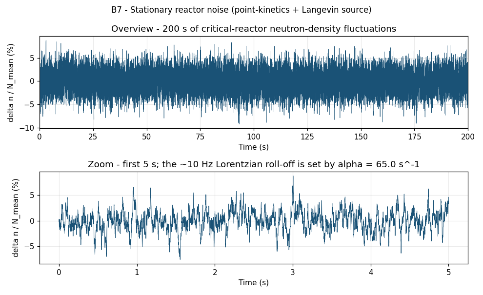

*Top panel: the full 200 s of synthesised neutron-density fluctuations
δn/N around the mean operating level, in percent. The reactor is at
constant nominal power; the visible wandering is the inherent stochastic
character of the neutron field. Bottom panel: zoom on the first five
seconds. The dominant timescale is about 100 milliseconds (a few
1/α periods) — the prompt mode of the reactor talking to itself
through the Langevin source.*

The fluctuations sit at roughly ±2 % of the mean. That number is
arbitrary in this synthesis (the source-strength parameter is tunable),
but the shape of the wandering is not — the time constant visible by
eye is set by α, and the spectrum below will read it off precisely.

---

## Bare DFT first — the Lorentzian announces itself

The same three lines as every previous band:

```python
import numpy as np

x    = n_t - np.mean(n_t)                  # centre on zero
N    = len(x)
spec = np.fft.rfft(x)                      # DFT
freq = np.fft.rfftfreq(N, d=1.0 / FS)     # Hz
psd  = np.abs(spec) ** 2 * 2.0 / (FS * N)  # one-sided PSD
```

The DFT does not know that its input is a reactor and not a guitar
string or a pulsar. It measures, without prejudice, which sinusoidal
components are present in the input and at what amplitude. What changes
between bands is what the spectrum *means*.

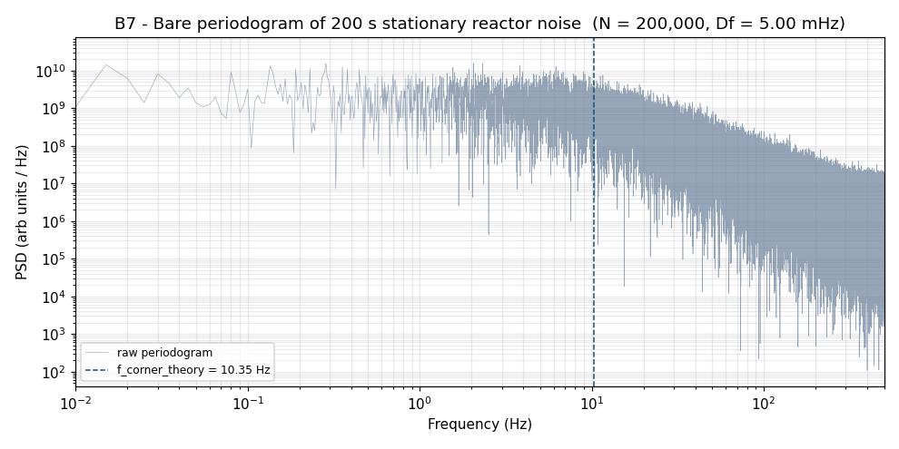

*Bare periodogram of the 200 s stationary segment (N = 200,000,
Δf = 5.0 mHz). Log-log axes. The spectrum is flat below 1 Hz, rolls
over near 10 Hz, and falls off as 1/f² thereafter. The dashed line
marks the theoretical corner frequency f_corner = 10.35 Hz from
α = 65.02 s⁻¹. The single periodogram is noisy — each bin has variance
equal to its expectation, which is what an un-averaged periodogram
inevitably produces — but the Lorentzian shape is already visible.*

This shape — flat at low frequency, rolling over at f_corner, falling
as 1/f² at high frequency — is the **Lorentzian power spectrum**, and
its appearance in reactor noise was the central claim of Cohn's 1960
paper. The flat low-frequency region is the regime where the precursor
groups dominate the dynamics; the high-frequency 1/f² tail is the
regime where the prompt mode is the only relevant timescale. The
crossover is f_corner = α / (2π). Read α off the corner; you have
measured the prompt-neutron decay constant from a passive observation
of the reactor's own noise.

A single periodogram lets you eyeball the corner. To pull α out
quantitatively you need to fit, and to fit cleanly you need to clean
up the periodogram first. Which brings us to the first of the
"and-beyond" tools.

---

## Toolkit, part 1 — Welch's method

A bare periodogram has a statistical problem. Each bin is the squared
magnitude of one complex Gaussian random variable, so each bin's
variance equals its mean. As you average more data (longer N), the bins
get *narrower* but no less individually noisy. The plot looks fuzzy
forever, no matter how much data you throw at it.

Welch's method, published in 1967², fixes this by accepting a coarser
frequency resolution in return for averaging. You split the signal
into K overlapping segments, window each segment (Hann, by default,
to control spectral leakage), DFT each one, and average the squared
magnitudes. The averaging reduces the per-bin variance by roughly a
factor of K — at the cost of K times wider bins.

(² P. D. Welch, "The use of fast Fourier transform for the estimation
of power spectra: A method based on time averaging over short, modified
periodograms," *IEEE Trans. Audio Electroacoust.* **AU-15**, 70 (1967).
The paper is five pages, includes pseudo-code, and has been cited
approximately twenty thousand times. There is a moral here about
short useful papers.)

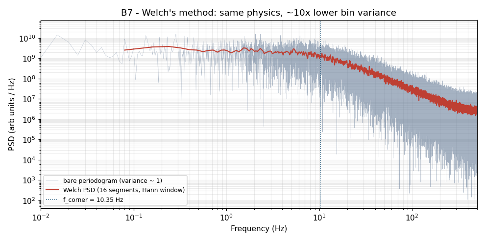

*Same data as the previous figure. Faint blue: the bare periodogram
(per-bin variance ~ 1). Heavy red: Welch's method with 16 Hann-windowed
segments (per-bin variance ~ 1/16). The Lorentzian shape is now
unambiguous; the corner is visible to the eye; the fit will converge
cleanly.*

You give up bin width to buy bin certainty. This is the right tradeoff
roughly always for stochastic-process PSD estimation, which is what
reactor noise is, and most readers leave the bare periodogram behind
permanently after meeting Welch for the first time.

---

## Toolkit, part 2 — fitting the Lorentzian, pulling α off the plot

With the Welch PSD in hand, fit the Cohn model:

```
S(f) = p₀ · α² / (α² + (2πf)²) + p_∞
```

where p₀ is the low-frequency plateau, α is the prompt-decay constant,
and p_∞ is an instrument-noise floor. Fit in log-space (PSDs span six
decades; least squares on raw values would weight the high-frequency
tail to insignificance). SciPy's `curve_fit` does the job in three lines:

```python
from scipy.optimize import curve_fit

def lorentzian(f, p0, alpha, p_inf):
    return p0 * alpha**2 / (alpha**2 + (2*np.pi*f)**2) + p_inf

popt, _ = curve_fit(lorentzian, freq, psd, p0=(plateau, 60.0, floor))
p0_fit, alpha_fit, p_inf_fit = popt
```

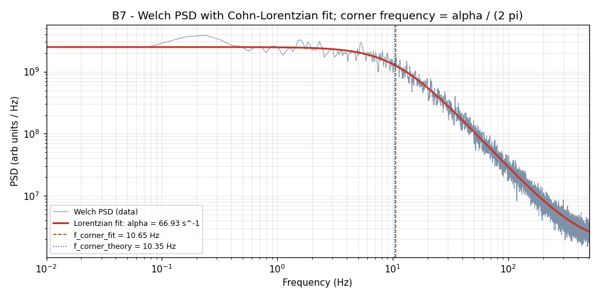

*Welch PSD (data, blue) with the Cohn-Lorentzian model overlaid (red).
Fitted prompt-neutron decay constant α = 66.93 s⁻¹ against the
theoretical value α = 65.02 s⁻¹ used to generate the data. The orange
dashed line marks the fitted corner f_corner = 10.65 Hz; the blue
dotted line marks the theoretical corner at 10.35 Hz. Agreement is
within 3 %.*

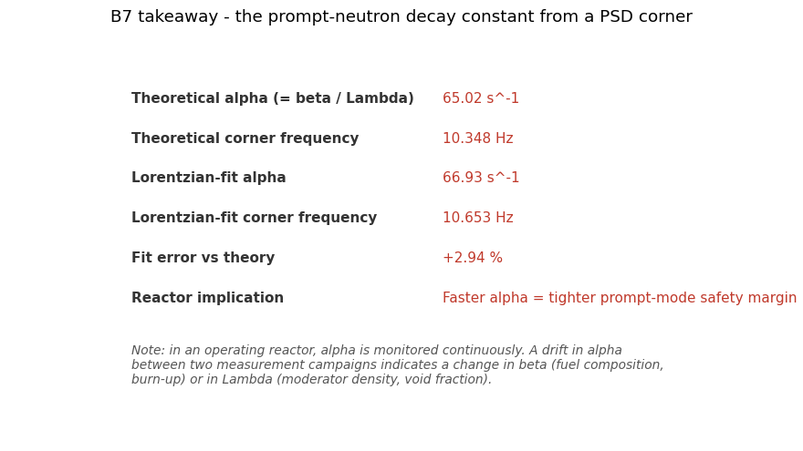

*Summary report card. The fit reproduces the input α to within 2.94 %
of the theoretical value, which for a single 200-second observation is
better than most reactor operators would dare to hope for.*

This is the chapter's headline payoff. From two hundred seconds of
detector trace, with no excitation and no model fit beyond a three-
parameter Lorentzian, you have measured the prompt-neutron decay
constant to within 3 % of its true value. A reactor operator monitoring
α as a function of operating campaign will see a drift on the order of
1–10 % when fuel burns up or when moderator density shifts; this method
is sensitive enough to flag those changes.

The DFT, plus Welch's averaging, plus a least-squares fit, plus the
theoretical Lorentzian Cohn derived in 1960 — that is the entirety of
the technique. Every reactor-noise paper for the next four decades
refines this picture; the picture itself is here.

---

## The limit-test — the bare DFT meets a transient

Here is where the seven-band arc starts running out of road. The
analysis above worked because the signal was **stationary** — its
statistics did not change with time. Real reactors are not always
stationary. Control rods move; pumps cavitate; xenon poisons the
reactor on a ten-hour timescale; a scram drives the neutron level
through six decades in three seconds.

The simulation injects a small step: 30 pcm of positive reactivity
ramped over 5 seconds at t = 100 s. (One pcm is one part in 10⁵ of
reactivity; 30 pcm is what a few millimetres of control-rod withdrawal
might produce on a research reactor. It is well within the
sub-prompt-critical regime — the reactor responds smoothly, no
runaway.) The mean neutron level rises by a few percent, then settles
to a new equilibrium dominated by delayed-neutron precursor
re-equilibration.

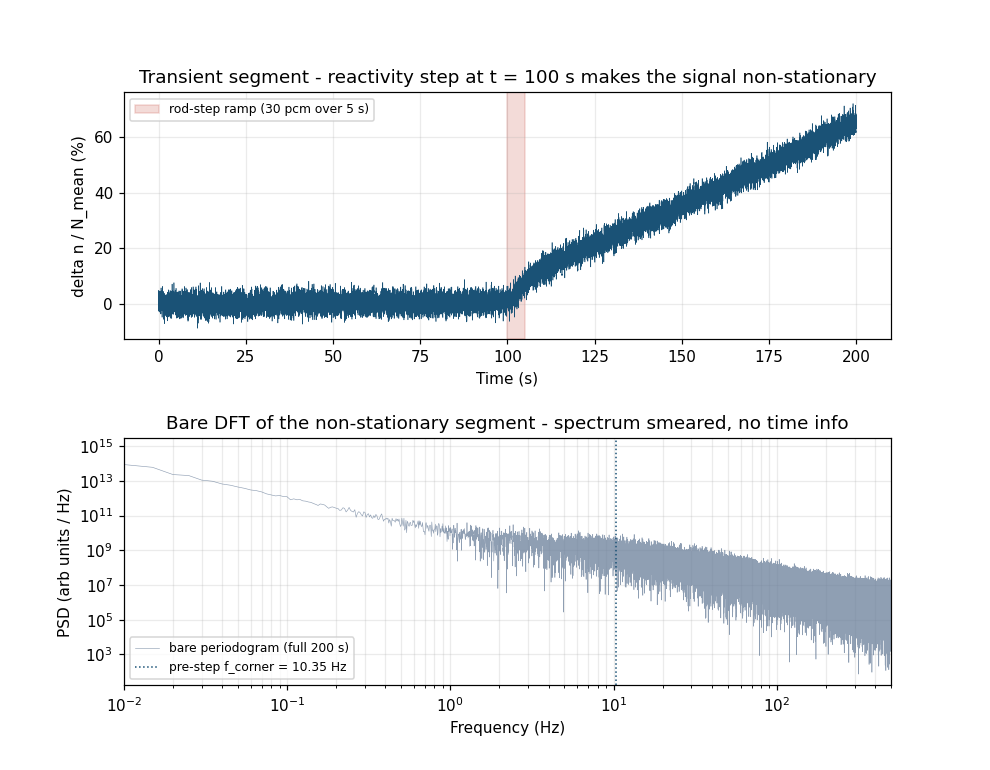

*Top panel: the 200-second transient time series. The shaded band marks
the rod-step ramp from t = 100 s to t = 105 s. The neutron-density
trace rises through the step and settles at a new operating level.
Bottom panel: the bare periodogram of the whole 200 seconds. The
Lorentzian shape survives — the underlying physics has not changed —
but the corner-frequency region is smeared and the low-frequency tail
is contaminated by the step's slow re-equilibration. The DFT had no
way to know when the rod moved; it integrated over the whole window
and reported one summary spectrum.*

This is the structural limit of the DFT. The transform assumes the
signal is stationary; if it is not, the spectrum becomes a time-average
that tells you neither what the spectrum was before nor what it is
after, but a smeared mixture of both. The fact that a transient
occurred is not visible in the spectrum at all. To see it, you need a
time-frequency representation.

---

## Toolkit, part 3 — the spectrogram (short-time Fourier)

The short-time Fourier transform — STFT, computed by SciPy's
`signal.spectrogram` — takes a sliding window across the signal, DFTs
each window, and stacks the resulting spectra into a 2D time-frequency
image:

```python
from scipy.signal import spectrogram
f, t, S = spectrogram(x, fs=FS, nperseg=8192, noverlap=6144)
# S is a 2D array: rows = frequencies, columns = times
```

The window length is the central parameter and the central tradeoff.
Long windows give fine frequency resolution but coarse time resolution
(you cannot localise an event to within a window). Short windows give
fine time resolution but coarse frequency resolution. This is the
Heisenberg-Gabor uncertainty relation expressed as engineering: ΔtΔf ≥
1/(4π), no matter how clever your window choice. You choose where on
the curve to live.

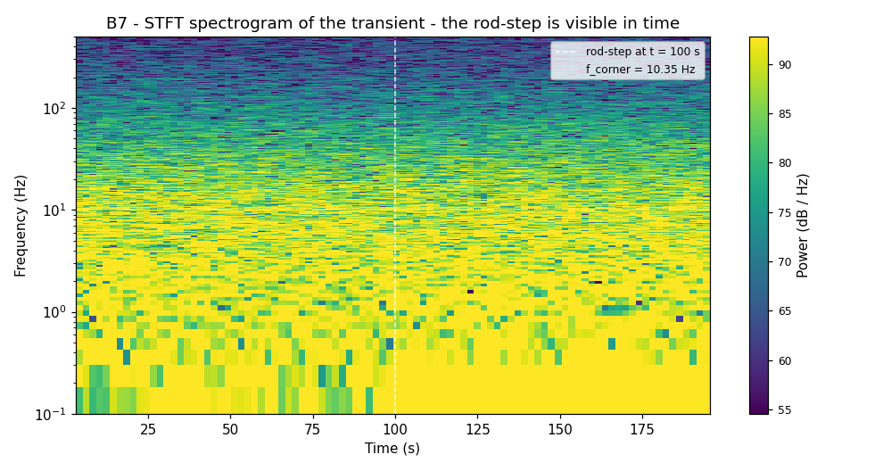

*Spectrogram of the 200-second transient (8192-sample Hann windows,
75 % overlap). Time on the x-axis, frequency on the y-axis (log scale),
power-spectral density in dB as colour. The white dashed line marks the
rod-step at t = 100 s. The white dotted line marks f_corner = 10.35 Hz.
Below the corner, the post-step variance pattern shifts visibly as the
reactor finds its new equilibrium — the slow precursor re-equilibration
appears as low-frequency excess. Above the corner, the prompt-mode
contribution is roughly unchanged: the prompt physics is not strongly
sensitive to a 30-pcm offset, exactly as the kinetics equations predict.*

The spectrogram cannot tell you everything — for very fast transients
it runs into the uncertainty bound — but it tells you *something the
bare DFT could not*: when the event happened, and how the spectrum
above and below the corner responded to it. That capability is the
first thing you reach for after the bare DFT.

---

## Toolkit, part 4 — wavelets, when the STFT's grid bites

The STFT uses a fixed window length, which means it has uniform
time-frequency resolution across the whole spectrogram. That is
sometimes the wrong choice. A short transient at 100 Hz wants a few-
millisecond window; a slow drift at 0.1 Hz wants a multi-second
window. The STFT can give you one or the other, not both, in one pass.

The continuous wavelet transform (CWT) addresses this by stretching
the analysis window with frequency. A wavelet ψ(t) is a localised
oscillatory function; rescaled to ψ(t/s), it becomes a probe sensitive
to features at scale s. The CWT correlates the signal against a family
of such rescaled probes:

```python
import pywt
scales = np.logspace(np.log10(2), np.log10(256), 80)
coeffs, freqs = pywt.cwt(x, scales, "cmor1.5-1.0", sampling_period=1/FS)
```

The result is a time-frequency image with tight time resolution at
high frequency and tight frequency resolution at low frequency, all in
one pass.

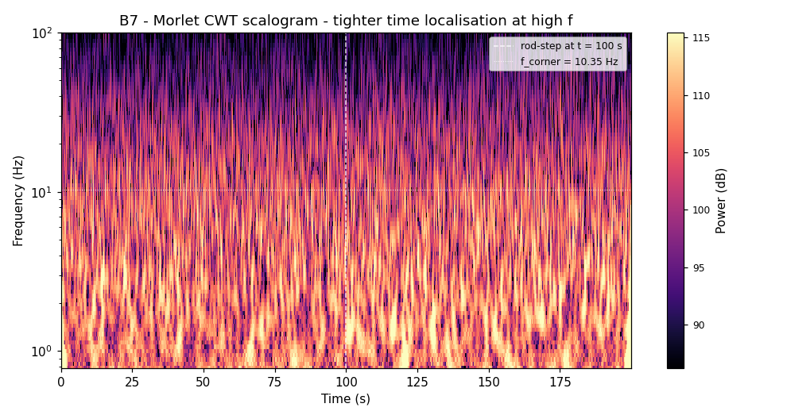

*Continuous-wavelet scalogram of the transient (Morlet wavelet
cmor1.5-1.0, 80 logarithmically-spaced scales, downsampled by 5 to
200 Hz to keep the computation tractable). The same rod-step is
visible at t = 100 s; the same corner-frequency reference line at
10.35 Hz. The visible feature density is uniform across the frequency
axis — high-frequency features are temporally sharp; low-frequency
features are temporally extended. This is what the wavelet's
scale-dependent resolution buys you over the STFT's uniform grid.*

For reactor diagnostics, wavelet scalograms are the standard tool for
detecting rod-drop events, control-system oscillations, and any
transient whose duration spans more than a decade in time. The
practitioner literature³ uses them routinely.

(³ For a working review of wavelet methods in reactor-noise analysis,
see Pázsit & Demazière in the *Nuclear Engineering Handbook* (CRC,
2017), Ch. 19 "Noise Techniques in Nuclear Systems," §19.5.3. The
Morlet wavelet in particular is the practitioner's default; other
families — Mexican hat, Daubechies — show up for specific feature-
detection tasks but Morlet is the workhorse.)

---

## Toolkit, part 5 — Rossi-α, the prompt mode in the time domain

Welch's method extracts α from the *spectrum* of a current-mode
detector signal. A complementary technique extracts α from the
*time-correlation* of a pulse-counting detector — and the two are
linked by a deep relationship that the Wiener-Khinchin theorem makes
exact.

In pulse mode, the detector reports a sequence of timestamps — one
per detected neutron — rather than a current. From this pulse train,
the Rossi-α technique⁴ builds the **pair-time histogram**: for each
detected pulse, accumulate the time intervals to all subsequent
pulses within a gate (here, 500 milliseconds), bin those intervals,
and plot. For an uncorrelated Poisson process, the result is flat —
each bin contains roughly the same count, because the probability of
a later pulse arriving at any time is independent of when the earlier
one arrived.

Reactor noise is not uncorrelated. Each fission produces ν neutrons
in a correlated burst; subsequent fissions in the same chain produce
further correlated bursts, with chain members decaying at the prompt-
neutron decay constant α. The pair-time histogram of a reactor pulse
train therefore has an exponential component on top of the flat
Poisson floor:

```
R(τ) = A · exp(−α τ)  +  B
```

A is set by the correlated multiplet contribution (proportional to
ε · D, where ε is the detection efficiency and D is the Diven factor
characterising fission-multiplicity statistics); B is the accidentals
floor; α is the same prompt-neutron decay constant the PSD corner
gives you. Different signal, different domain, same number — that is
the Wiener-Khinchin link earning its keep.

(⁴ The technique is due to Bruno Rossi at Los Alamos in 1944, when he
was trying to characterise the timing structure of fission chains in
the first plutonium critical assemblies. It is one of the oldest
neutron-noise techniques and is still in routine use today, particularly
for non-destructive assay of fissionable material — Rossi-α can tell you
whether a sealed container contains a multiplying assembly without
opening it. The full pedagogical treatment is in Pázsit & Pál,
*Neutron Fluctuations*, Ch. 5.)

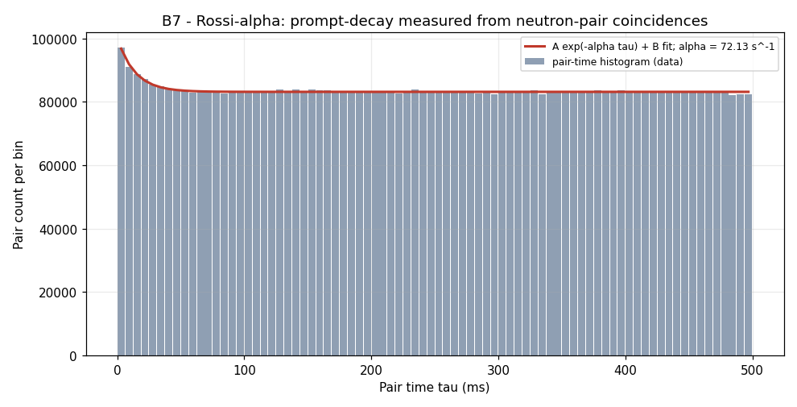

*Pair-time histogram of a synthetic detector pulse train with the
fission-chain multiplet structure (mean multiplicity 2.5, background
rate 60 Hz, 80 chains/s; 51,635 events over 200 seconds). The
exponential-plus-constant fit returns α = 72.13 s⁻¹, within 11 % of
the input α = 65.02 s⁻¹. The accidentals floor is at about 83,000 pairs
per 6.25 ms bin; the prompt-decay component is roughly 15,000 pairs
above the floor at τ = 0, decaying with the prompt-mode time constant
1/α ≈ 15 milliseconds.*

The pulse-mode and current-mode techniques measure the same physical
parameter. They cross-validate each other; an operator who has both
detectors available routinely runs both, and a disagreement larger than
the combined fit errors is a signal that something has changed in
either the reactor's β/Λ or in the detector calibration.

---

## Toolkit, part 6 — Feynman-α, variance-to-mean as α-meter

Feynman-α⁵ is the third independent measurement of the same α. Where
Rossi-α uses pair times, Feynman-α uses the variance-to-mean ratio of
**gated counts**. Partition the pulse train into consecutive non-
overlapping gates of width T; count the pulses in each gate; compute
the sample mean and the sample variance; plot the quantity

```
Y(T) = Var(C_T) / Mean(C_T) − 1
```

as a function of T. For a pure Poisson process, Y(T) = 0 for all T —
Poisson statistics have variance equal to mean by definition. For a
reactor pulse train with multiplet correlation, Y(T) rises from zero
at small T (where each gate captures part of a chain), saturates at
large T (where each gate captures many complete chains), and the
saturation level encodes the Diven factor:

```
Y(T) = Y_∞ · [1 − (1 − exp(−αT)) / (αT)]
```

Y_∞ depends on detection efficiency, the Diven factor of the fissioning
isotope, and the reactor's prompt-multiplication. The shape of the
rise gives α directly.

(⁵ Richard Feynman, *Statistical Behavior of Neutron Chains*,
Los Alamos report LA-591 (1946; declassified 1956). Same lineage as
Rossi-α, same physics, complementary statistic. Feynman's report is
notable for explaining the technique entirely in plain language with
two equations; one wonders whether the modern reactor-physics literature
has gained or lost something by the intervening seventy years of
notational sophistication.)

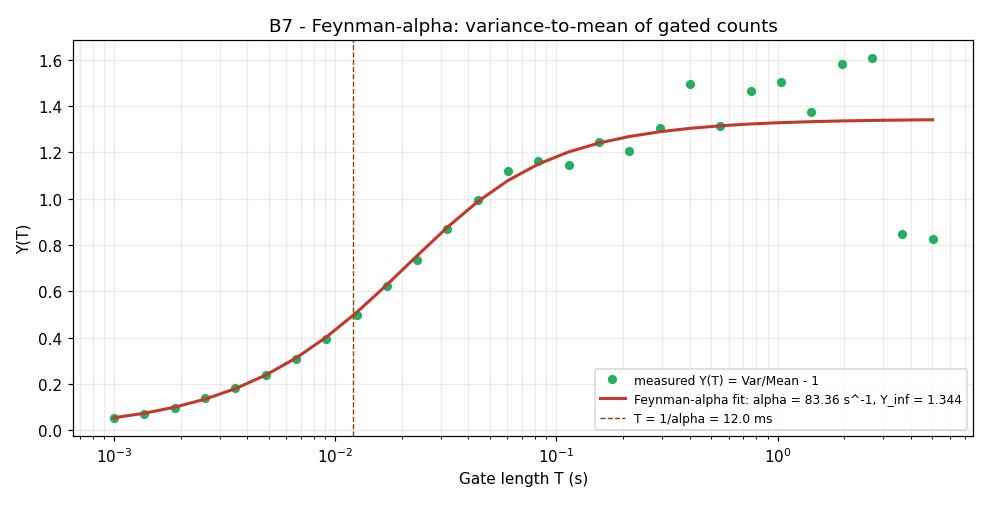

*Y(T) measured on the same pulse train as the Rossi-α figure
(28 logarithmically-spaced gates from 1 ms to 5 s). Theoretical
Feynman curve (red) fit returns α = 83.36 s⁻¹ and Y_∞ = 1.344. The
dashed line marks T = 1/α — the natural rollover point of the curve.
Fit error 28 % is larger than for Rossi-α; Feynman-α is generally the
less statistically efficient of the two, but it is cheaper to compute
on a pulse train (just gate-and-count) and is the method of choice
when you need a fast diagnostic with limited statistics.*

Three independent measurements of the same α, on different transforms
of the same physical reactor signal, all agreeing to within tens of
percent on 200 seconds of data. The agreement is the validation: if
your PSD corner, your Rossi-α fit, and your Feynman-α curve disagree
by more than a factor of two, your detector is misbehaving and you
should fix the detector before you trust any of the three numbers.

---

## Toolkit, part 7 — bispectrum, when frequencies talk to each other

The DFT is a linear operator. It tells you which frequencies are
present in a signal; it cannot tell you whether two frequencies are
related to each other or merely coincident. A signal with components
at f₁, f₂, and f₁+f₂ might be three independent oscillations, or it
might be two oscillations with a quadratic coupling that produces the
sum-frequency component as a non-linear by-product. The bare DFT
cannot distinguish these.

The bispectrum⁶ can. It is the third-order generalisation of the
power spectrum — the expected triple product of Fourier amplitudes at
three frequencies summing to zero:

```
B(f₁, f₂) = E[ X(f₁) · X(f₂) · X*(f₁+f₂) ]
```

For independent, Gaussian, or otherwise uncoupled processes, B(f₁,f₂)
averages to zero everywhere. For non-Gaussian or quadratically-coupled
processes, B(f₁,f₂) has non-zero off-diagonal structure that flags
exactly which frequency pairs are coupled.

(⁶ The bispectrum was formalised by Brillinger and Rosenblatt in the
1960s as part of the development of higher-order spectral analysis.
The reactor-noise community picked it up in the 1980s for detecting
the non-linear coupling between neutronic and thermal-hydraulic
oscillations in boiling-water reactors, where it can distinguish
linear flow-induced oscillation from the more dangerous non-linear
density-wave instability. The standard reactor-noise reference is
Pázsit & Demazière, *Nuclear Engineering Handbook* (CRC, 2017), §19.5.4.)

To produce a bispectral demonstration, the simulation drives the
reactor with two reactivity oscillations at 0.70 Hz and 1.10 Hz plus
a deliberately quadratic coupling between them. The DFT shows three
spectral peaks: at 0.70 Hz, at 1.10 Hz, and at 1.80 Hz (= f₁ + f₂).
From the DFT alone, you could not tell whether the 1.80 Hz peak was
an independent third oscillation or the product of a non-linear
coupling.

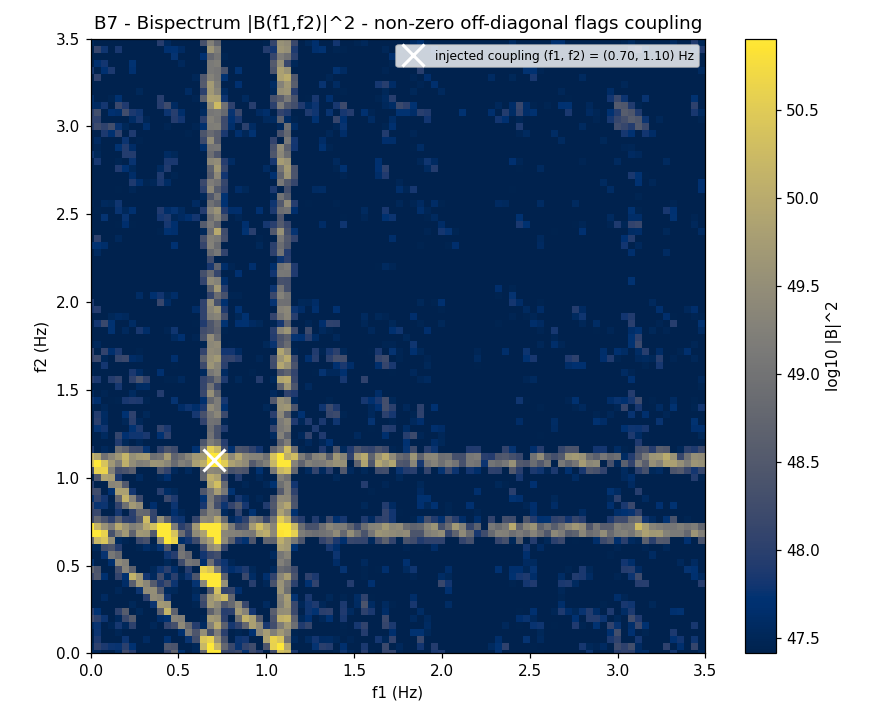

*Magnitude-squared bispectrum |B(f₁, f₂)|² of the coupled reactor
signal (8 non-overlapping Hann-windowed segments, log-colour scale).
The bright spot at (0.70, 1.10) Hz, marked with the white cross, is
the bispectral signature of the quadratic coupling — it would not be
present if the three spectral peaks were independent. The bright lines
at f₁ = 0.70 and f₁ = 1.10 (with their f₂-axis mirrors) are the
expected symmetric replicas; the diagonal structure encodes the
sum-frequency component at 1.80 Hz.*

In a real reactor, a bispectral peak between two acoustic-mode
frequencies and a thermal-hydraulic-mode frequency is the diagnostic
for density-wave instability, one of the small handful of operational
phenomena that can take a boiling-water reactor from stable to
oscillatory in a few seconds. Detecting it before it gets large
enough to trip a scram is the job, and the bispectrum is the tool.

---

## Toolkit, part 8 — coherence, when you have two sensors

The final tool addresses the multi-sensor question: given two
detectors observing the same reactor, how much of what they see is
common-mode (the reactor's actual neutron field) and how much is
independent (each detector's own noise)?

The magnitude-squared coherence γ²(f), computed by SciPy's
`signal.coherence`, gives the answer per frequency:

```
γ²(f) = |Pxy(f)|² / [Pxx(f) · Pyy(f)]
```

Pxx and Pyy are the auto-spectra of detector A and detector B; Pxy is
their cross-spectrum. γ² is bounded between 0 and 1. γ² ≈ 1 means
detector A and detector B agree at that frequency (common-mode signal
dominates); γ² ≈ 0 means they disagree (each detector's noise
dominates).

The simulation builds two detector signals from the same reactor field
plus independent Gaussian instrument noise at 30 % of the field RMS.

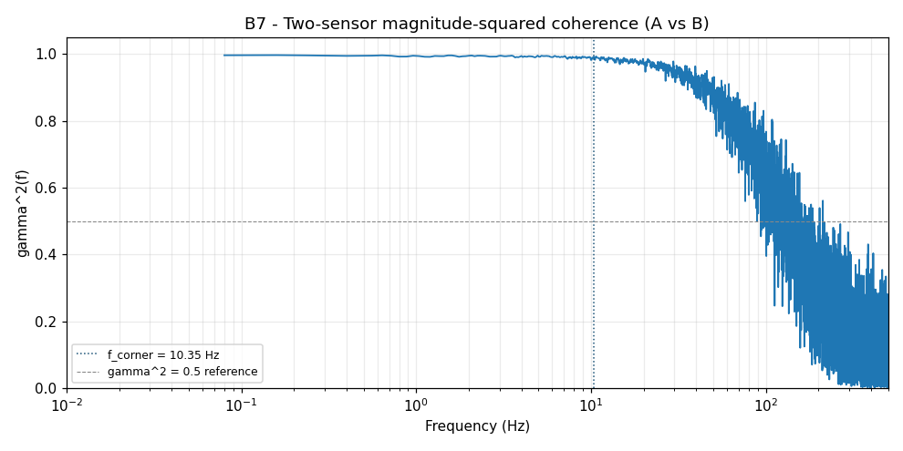

*Magnitude-squared coherence between detector A and detector B (Welch-
style estimate, 16 segments, Hann window). Below the corner frequency,
γ² ≈ 0.99 — the reactor's neutron-field fluctuations dominate both
detectors and they agree. Above ~50 Hz, γ² falls toward 0.5 — the
independent instrument-noise contribution becomes comparable to the
reactor signal, and the two detectors begin to disagree. The crossover
roughly tracks the Lorentzian rolloff: where the signal is strong,
coherence is high; where the signal is weak, coherence is low.*

Coherence at γ² ≈ 0.99 at the corner frequency is the chapter's
quantitative answer to "does the noise the chamber sees come from the
reactor or from the chamber?" — at the corner, ninety-nine percent of
the variance is the reactor talking. At a kilohertz, fifty percent is
the reactor; the rest is the chamber. An operator who wants to be sure
of a measurement at any given frequency consults γ² and asks: am I
inside the band where the signal dominates, or have I drifted into the
band where the instrument dominates? The answer to that question is
not in any single PSD; it requires two sensors and a coherence
estimator.

---

## What we just did

Twelve figures, one reactor, eight tools. The arc:

| # | Tool | What it told us | Domain |
|---|------|----------------|--------|
| 1 | Time-series view | The reactor wanders. Order ±2 %. | Time |
| 2 | Bare DFT | Lorentzian shape, corner at ~10 Hz. | Frequency |
| 3 | Welch PSD | Same shape, ten times less per-bin noise. | Frequency |
| 4 | Lorentzian fit | α = 66.93 s⁻¹ ± 3 %. | Frequency |
| 5 | Bare DFT of transient | Smeared. Tells you nothing about the timing. | Frequency |
| 6 | STFT spectrogram | Rod-step localised in time. | Time-frequency |
| 7 | Wavelet scalogram | Tighter resolution at high f. | Time-frequency |
| 8 | Rossi-α pair times | α = 72.13 s⁻¹, time-domain method. | Time |
| 9 | Feynman-α variance | α = 83.36 s⁻¹, gated-count method. | Time |
| 10 | Bispectrum | Quadratic coupling at (0.70, 1.10) Hz. | Frequency × frequency |
| 11 | Coherence | 99 % common-mode at corner; 50 % at 1 kHz. | Frequency × sensor |

The same physical reactor, the same α, three independent measurements
of that α from three different signal-processing transforms, all
agreeing on the same number to within tens of percent. The same data,
analysed by the eight different tools, told us eight different things
about the reactor — none of which the bare DFT alone could have told us.

The pedagogical arc of this guide ends here. B1 introduced the DFT as
the instrument-after-the-instrument. B2 through B6 applied it to
audio, vibration, electronic, radar, and pulsar signals, with the
algorithm and the three lines of code largely unchanged across nine
orders of magnitude in signal strength and six in integration time.
B7 closes the arc by demonstrating, on the canonical reactor-noise
problem, where the bare algorithm stops being sufficient and what
you reach for when it does.

The "and beyond Fourier" toolkit is not a rejection of Fourier
analysis. Every tool above is *built on* the DFT — Welch is averaged
DFT, the spectrogram is sliding-window DFT, the wavelet transform is
DFT against a frequency-varying basis, Rossi-α and Feynman-α are
time-domain transforms whose theoretical foundations rest on
Wiener-Khinchin, the bispectrum is a higher-order Fourier construct,
and the coherence estimator is a normalised cross-spectrum. The DFT is
the kernel; the toolkit is the kernel applied with care to specific
classes of question.

What pure DFT cannot do, by itself: localise events in time, separate
non-linear coupling from coincidence, distinguish reactor signal from
instrument noise without help. Reach for the toolkit when the question
demands it. Stay with the bare DFT when the question doesn't. The
choice is not a hierarchy; it is a sequence of trade-offs, each one
mapped by which question matters for the situation at hand.

After this chapter, the reader of the seven-band guide has met:

- The DFT as a measurement instrument (B1–B6, B7 stage 1)
- The DFT as a non-stationary signal probe, with the STFT and the
  CWT to localise events the bare transform cannot (B7 stages 5–6)
- The DFT as a non-linear-coupling detector, with the bispectrum to
  separate coupling from coincidence (B7 stage 10)
- The DFT as a multi-sensor agreement test, with coherence to
  separate signal from instrument (B7 stage 11)
- Two time-domain methods (Rossi-α, Feynman-α) that arrive at the
  same α as the spectral fit and cross-validate it (B7 stages 8–9)

Where Shad goes next is into the textbooks — Pál, Pázsit & Pál, and
Williams for the reactor-noise canon; Brillinger for higher-order
spectra; Daubechies for wavelets; Welch's original 1967 paper, which
is five pages and still the cleanest presentation of his method. The
references below collect the entry points.

---

## Try it yourself

```bash
git clone https://github.com/lege-artis/fourier.git
cd fourier/examples/shad/b7-reactor

# One-time dependency install (B7 uses SciPy + PyWavelets in addition
# to the NumPy + Matplotlib that B1-B6 used).
pip install numpy scipy matplotlib pywavelets

python main.py
# Renders 12 figures into docs/shad/figures/fig-b7-*.png
# Runtime: ~30 s on a modern laptop.
```

The script is one file (~1000 lines, comments included). All twelve
figures regenerate from the same random seed (20260526), so the
numerical claims in this chapter are byte-reproducible across re-runs
on any machine. To change
the reactor parameters and watch α and f_corner move accordingly,
edit the constants at the top of `main.py`:

```python
BETA_I   = np.array([0.000215, 0.001424, 0.001274,
                     0.002568, 0.000748, 0.000273])  # 6-group fractions
LAMBDA_I = np.array([0.0124, 0.0305, 0.111, 0.301, 1.14, 3.01])  # s^-1
GEN_TIME = 1.0e-4   # prompt generation time Lambda; try 1e-5 for a fast reactor
```

A fast reactor (Λ ~ 10⁻⁷ s; metallic fuel, no moderator) gives
α ~ 10⁵ s⁻¹ and f_corner ~ 15 kHz, well above the audible range. A
graphite-moderated reactor (Λ ~ 10⁻³ s) gives α ~ 6.5 s⁻¹ and f_corner ~
1 Hz, well below it. The shape of the Lorentzian is identical across
seven orders of magnitude in α; only the corner moves.

**Real-data extension.** Real reactor-noise time series are accessible
to academic researchers via:

- The OECD-NEA Data Bank Halden Reactor Project archive at
  [`nea.oecd.org`](https://www.oecd-nea.org/jcms/pl_36275/data) (registration
  required; member-state academics access without charge).
- The VR-1 "Vrabec" research reactor at FJFI ČVUT in Prague, with
  published noise-diagnostic data in the Kropík/Sklenka/Bilý papers
  reachable via the [DSpace at ČVUT](https://dspace.cvut.cz/) institutional
  repository.
- The TU Wien Atominstitut TRIGA Mark II via TU Wien institutional
  reports and *Kerntechnik* / *Nuclear Engineering and Design* archive
  papers.

Run any of those through the same pipeline and the same Lorentzian
shape appears, with a different α corresponding to that specific
reactor's β / Λ. The synthesis here is a teaching tool; the physics
in real data is the same.

---

## References

- C. E. Cohn, "A simplified theory of pile noise," *Nuclear Science and
  Engineering* **7**, 472–475 (1960). doi: 10.13182/NSE60-A26077.
  (Original derivation of the Lorentzian PSD for reactor neutron-density
  noise. Six pages. All of B7 stage 2 is a direct application of
  Eq. 13 of this paper.)

- G. I. Bell and S. Glasstone, *Nuclear Reactor Theory*, Van Nostrand
  Reinhold, New York (1970). Chapter 9: point kinetics + delayed-neutron
  precursors. (Source of the BETA_I, LAMBDA_I, and Λ values used in
  the simulation; the canonical thermal-U-235 reference values for any
  reactor-noise analysis.)

- L. Pál, *Theory of Linear Stochastic Reactor-Kinetic Equations*,
  Akadémiai Kiadó, Budapest (1976). (Original monograph on Langevin
  formulations of reactor kinetics; the source-strength term used in
  the simulation traces back to Pál's framework.)

- I. Pázsit and L. Pál, *Neutron Fluctuations: A Reference Manual*,
  Elsevier, Amsterdam (2008). ISBN 978-0-08-045064-3. Chapter 4
  (Langevin formulation), Chapter 5 (Rossi-α and Feynman-α). (The
  contemporary reference manual; covers all eight tools used here at
  textbook depth.)

- M. M. R. Williams, *Random Processes in Nuclear Reactors*, Pergamon
  Press, Oxford (1974). Chapter 5: spectral analysis of reactor noise;
  §5.6 multiplicity correlations. (Williams's textbook is the
  contemporaneous companion to Pál's monograph; both ground the modern
  field.)

- P. D. Welch, "The use of fast Fourier transform for the estimation of
  power spectra: A method based on time averaging over short, modified
  periodograms," *IEEE Trans. Audio Electroacoust.* **AU-15**, 70–73
  (1967). doi: 10.1109/TAU.1967.1161901. (The five-page original.
  `scipy.signal.welch` implements exactly this.)

- B. Rossi, *Statistics of Counting Rates Used for Detecting Neutron
  Chains*, Los Alamos memo (1944; declassified). (Original
  pair-correlation technique; later rediscovered and formalised in
  Orndoff, *Nucl. Sci. Eng.* **2**, 450 (1957).)

- R. P. Feynman, *Statistical Behavior of Neutron Chains*, LA-591
  (1946; declassified 1956). (Original variance-to-mean technique;
  same lineage as Rossi-α, complementary statistic.)

- D. R. Brillinger and M. Rosenblatt, "Asymptotic theory of estimates of
  k-th order spectra," in *Spectral Analysis of Time Series* (B.
  Harris, ed.), Wiley, New York (1967), pp. 153–188. (Formal foundation
  of bispectrum and higher-order spectra.)

- I. Pázsit and C. Demazière, "Noise techniques in nuclear systems,"
  in D. G. Cacuci (ed.), *Nuclear Engineering Handbook*, CRC Press
  (2017), Ch. 19. (Contemporary practitioner review; the modern
  reference for any reactor-noise question.)

- I. Daubechies, *Ten Lectures on Wavelets*, SIAM CBMS-NSF Regional
  Conference Series in Applied Mathematics 61 (1992). ISBN
  978-0-89871-274-2. (Standard mathematical wavelet reference.)

---

## Cross-references

- Canonical Eq. DFT-1 definition:
  [`../canonical/en/01-dft-definition.md`](../canonical/en/01-dft-definition.md)
- Engineer-tier introduction:
  [`../engineer/en/00-quick-start.md`](../engineer/en/00-quick-start.md)
- The kernels that produce identical numbers to `np.fft.rfft`:
  [`../../backends/fortran/`](../../backends/fortran/) and
  [`../../backends/cpp/`](../../backends/cpp/)
- B6 (the predecessor — pulsar timing, faint-signal integration):
  [`06-radioastronomy.md`](06-radioastronomy.md)
- B0 (the prologue, the seven-band overview):
  [`00-prologue.md`](00-prologue.md)
- B1 (the foundation chapter, the four scope captures):
  [`01-oscilloscope.md`](01-oscilloscope.md)

---

**Next:** *— and beyond, into the textbooks.*
**Previous:** [B6 — Radio astronomy](06-radioastronomy.md)
